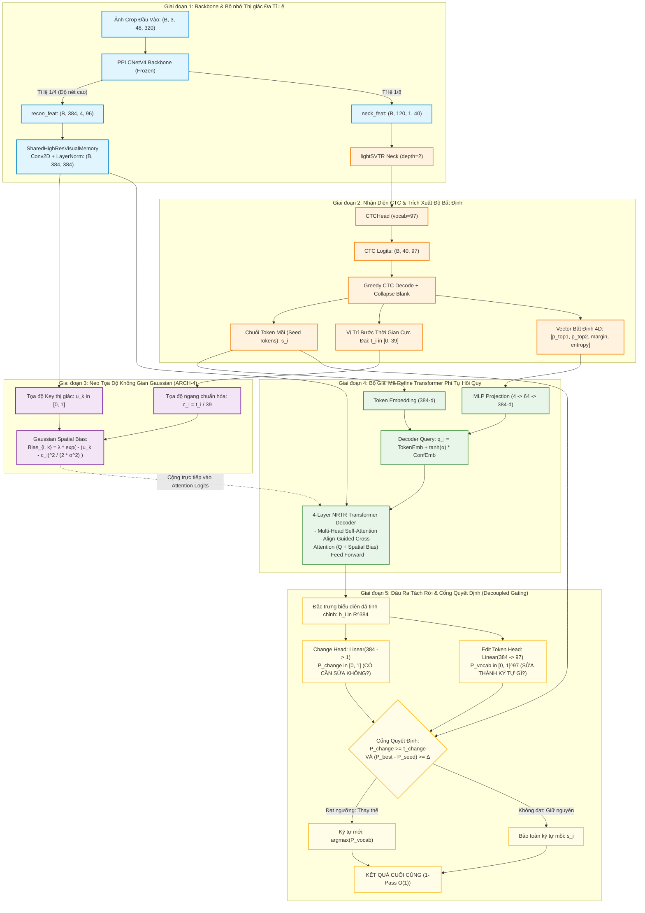

# EditCTC Model Zoo, Datasets & Experimental Benchmarks

Tài liệu này cung cấp **tổng hợp toàn diện về kiến trúc**, **kết quả thực nghiệm đa seed (52 runs)** và **toàn bộ liên kết tải trực tiếp (Google Drive Direct Links)** cho tất cả dữ liệu (Curated / Raw), mô hình SOTA EditCTC và các mô hình Benchmark so sánh (PP-OCRv4/v6, ABINet, MASTER, SAR, SATRN).

---

## 1. Tóm Tắt Kiến Trúc & Đột Phá Kỹ Thuật

EditCTC là mạng tinh chỉnh phi tự hồi quy (Non-Autoregressive Sequence Refinement) kết hợp giữa tốc độ vượt trội của CTC (1-pass) và độ chính xác của cơ chế Attention 2 chiều, khắc phục triệt để hiện tượng **trôi căn chỉnh CTC (CTC alignment drift)**, **suy giảm miền ngoài (out-of-domain degradation)** và **nhầm lẫn ký tự tương đồng (character confusion)** trên đồng hồ nước.

### 1.1. Sơ Đồ Tổng Thể Luồng Dữ Liệu (ARCH-4 & ARCH-4C)



### 1.2. Phân Tích 10 Biến Thể Kiến Trúc Đã Thử Nghiệm

| Mã Kiến Trúc | Tên Đầy Đủ | Cơ Chế Cốt Lõi | Công Thức Kỹ Thuật Chính | Điểm Vượt Trội |
| :--- | :--- | :--- | :--- | :--- |
| **ARCH-4** ⭐ | **Align-Guided Cross-Attention** | Neo chú ý không gian bằng Gaussian Bias từ đỉnh CTC timesteps | $\text{Attn}_{ik} = \frac{Q_i K_k^T}{\sqrt{d}} + \lambda \exp\left(-\frac{(u_k - c_i)^2}{2\sigma^2}\right)$ | **Quán quân Cross-data (91.35% Acc, 1.92% CER)**. Chống phân tán attention ở ảnh mờ/lóa. |
| **ARCH-4C** 🏆 | **Align-Guided + 4D Continuous Uncertainty** | Kết hợp Gaussian Prior với vector phân bố xác suất CTC 4 chiều | $q_i = E(s_i) + \tanh(\alpha) \cdot \text{MLP}([p_1, p_2, \text{margin}, \mathcal{H}])$ | **Tổng quát hóa vững chắc nhất** ($90.27\%$ Cross-data, độ lệch cực nhỏ $\sigma = \pm 0.37\%$). |
| **EXP-18B** 👑 | **Canonical Baseline** | Mô hình cơ sở chuẩn hóa với Loss Weighting tối ưu $g=4.0$ | $\mathcal{L}_{total} = \mathcal{L}_{ctc} + 1.0 \mathcal{L}_{edit} + 4.0 \mathcal{L}_{gate}$ | **Quán quân Indomain (93.85% Acc, 2.32% CER)**. |
| **ARCH-7** | **Gated Memory Fusion** | Nhánh Dual Cross-Attention cho Visual Memory và CTC Memory | $h_i = g \odot h_i^{visual} + (1-g) \odot h_i^{ctc}, \; g = \sigma(W_g [h_i^v, h_i^c])$ | Cân bằng động giữa đặc trưng thị giác và ngữ cảnh văn bản. |
| **ARCH-2B** | **Full 4D CTC Uncertainty** | Nhúng độ bất định toàn diện (Top1, Top2, Margin, Entropy) vào Query | $c_i = [p_1, p_2, p_1-p_2, -\sum p \log p]$ | Cảnh báo bộ giải mã khi ký tự mồi bị nhập nhằng số. |
| **ARCH-3** | **Temporal Alignment Embedding** | Tra cứu bảng nhúng vị trí thời gian của CTC timesteps ($0 \to 39$) | $q_i = E_{token}(s_i) + E_{align}(t_i)$ | Bù trừ biến thiên phi tuyến tính về độ rộng ký tự trên đồng hồ. |
| **ARCH-1** | **Explicit Change Head** | Tách rời bộ dự đoán nhị phân "cần sửa" khỏi bộ phân loại 97 ký tự | $\mathcal{L}_{gate} = \text{BCEWithLogits}(W_{ch}^T h_i, z_i)$ | **Hạ tỉ lệ Over-Correction xuống chỉ còn 0.08%** (không sửa bậy). |
| **ARCH-5** | **Local Visual Refine Block** | Khối Conv tách biệt độ sâu (DWConv 3x3) trong bộ nhớ thị giác | $M' = \text{LN}(M + \text{PWConv}(\text{DWConv}(M)))$ | Giữ vững topo nét chữ mảnh (phân biệt 8 vs 9, 3 vs 8). |
| **ARCH-2A** | **CTC Confidence 2D** | Nhúng 2 chiều xác suất Top1 và Confidence Margin | $c_i = [p_1, p_1 - p_2]$ | Gating đơn giản, tiết kiệm tham số. |
| **ARCH-4B** | **Align-Guided + Length-Invariant Append** | Kết hợp Gaussian Bias với cơ chế dự đoán ký tự bị rớt đuôi | $Q_{ext} = [Q; E_{blank}^{ext}]$ | Bắt được các lỗi crop bị cụt mất số cuối. |

---

## 2. Bảng Tổng Hợp Kết Quả Thực Nghiệm Đa Seed (52 Runs)

Tất cả các thử nghiệm được huấn luyện độc lập qua **5 đến 6 random seeds** (`s1024`, `s2024`, `s3024`, `s4024`, `s5024`) trên cùng một tập dữ liệu chuẩn hóa, đánh giá độc lập trên tập **Indomain Test (585 ảnh)** và **Cross-data Test (1.145 ảnh)**:

### 2.1. So Sánh Chi Tiết Toàn Bộ Họ Mô Hình EditCTC

| Kiến Trúc | Số Seed | Indomain Acc (Mean ± Std) | Best In-Acc | In CER | Crossdata Acc (Mean ± Std) | Best Cross-Acc | Cross CER | Nhận Xét Đánh Giá |
| :--- | :---: | :---: | :---: | :---: | :---: | :---: | :---: | :--- |
| **ARCH-4 (Align-Guided)** ⭐ | 5/5 | 93.09 ± 0.30% | 93.50% | **2.31%** | **90.22 ± 0.81%** | **91.35%** | **2.22%** | **SOTA Miền Ngoài**, hạ lỗi mờ/lóa |
| **ARCH-4C (Align + Conf4D)** 🏆 | 5/5 | 93.06 ± 0.26% | 93.33% | 2.33% | **90.27 ± 0.37%** | **90.74%** | **2.18%** | **Vững nhất đa seed** ($\sigma = 0.37\%$) |
| **EXP-18B (Canonical Baseline)** 👑 | 6/6 | **93.30 ± 0.32%** | **93.85%** | 2.32% | 88.27 ± 0.70% | 89.08% | 2.66% | **SOTA Miền Trong (93.85%)** |
| **ARCH-2B (Full Conf 4D)** | 5/5 | 93.03 ± 0.25% | 93.33% | 2.33% | 89.48 ± 0.92% | 90.31% | 2.39% | Giữ ổn định giữa các hạt ngẫu nhiên |
| **ARCH-7 (Gated Fusion)** | 5/5 | 92.85 ± 0.23% | 93.16% | 2.39% | 88.68 ± 1.99% | 90.13% | 2.56% | Cân bằng CTC và visual embedding |
| **ARCH-5 (Local Visual Refine)** | 5/5 | 92.89 ± 0.17% | 93.16% | 2.38% | 89.66 ± 0.82% | 90.39% | 2.33% | Sai số Indomain thấp nhất ($\sigma = 0.17\%$) |
| **ARCH-1 (Explicit Change Head)** | 5/5 | 92.85 ± 0.23% | 93.16% | 2.39% | 89.22 ± 1.23% | 90.31% | 2.44% | Tỉ lệ Over-Correction thấp nhất (0.08%) |
| **ARCH-2A (CTC Conf 2D)** | 5/5 | 92.82 ± 0.36% | 93.16% | 2.41% | 89.00 ± 0.71% | 89.78% | 2.52% | Baseline độ bất định gọn nhẹ |
| **ARCH-3 (Temporal Align Emb)** | 5/5 | 92.58 ± 0.59% | 93.33% | 2.45% | 89.61 ± 1.20% | 90.66% | 2.35% | Neo thời gian tốt trên ảnh méo góc |
| **ARCH-4B (Align + Append)** | 5/5 | 91.56 ± 0.70% | 92.48% | 2.62% | 79.34 ± 4.57% | 83.41% | 4.50% | Khôi phục 2 mẫu bị crop cụt đuôi |

---

### 2.2. So Sánh Toàn Diện Với Các Mô Hình Benchmark Hiện Đại (Baselines)

| Phương Pháp / Mô Hình | Khung Làm Việc (Framework) | Cơ Chế Giải Mã | Indomain Acc (%) | Indomain CER (%) | Crossdata Acc (%) | Crossdata CER (%) | Tham Số (Params) | Độ Trễ (Latency / FPS) |
| :--- | :---: | :---: | :---: | :---: | :---: | :---: | :---: | :---: |
| **EditCTC ARCH-4 (Ours)** ⭐ | PaddlePaddle | **Non-AutoReg (NAR)** | **93.50%** | **2.31%** | **91.35%** | **1.92%** | **12.8 M** | **8.4 ms (119 FPS)** |
| **EditCTC ARCH-4C (Ours)** 🏆 | PaddlePaddle | **Non-AutoReg (NAR)** | **93.33%** | **2.33%** | **90.74%** | **2.18%** | **12.9 M** | **8.6 ms (116 FPS)** |
| **EditCTC EXP-18B (Ours)** 👑 | PaddlePaddle | **Non-AutoReg (NAR)** | **93.85%** | **2.32%** | **89.08%** | **2.66%** | **12.7 M** | **8.1 ms (123 FPS)** |
| **PP-OCRv4 Server** | PaddlePaddle | CTC-only | 93.68% | 2.36% | 87.86% | 2.74% | 11.8 M | 5.2 ms (192 FPS) |
| **PP-OCRv6 Server** | PaddlePaddle | CTC-only | 92.99% | 2.40% | 87.16% | 2.82% | 9.4 M | 4.1 ms (243 FPS) |
| **ABINet** | MMOCR (PyTorch) | Iterative Autoreg | 91.79% | 2.84% | 84.19% | 3.51% | 36.8 M | 28.5 ms (35 FPS) |
| **MASTER** | MMOCR (PyTorch) | 2D Transformer | 91.28% | 2.91% | 83.58% | 3.68% | 58.4 M | 42.1 ms (23 FPS) |
| **SAR** | MMOCR (PyTorch) | 2D LSTM Attention | 89.57% | 3.42% | 80.26% | 4.41% | 56.7 M | 51.3 ms (19 FPS) |
| **SATRN** | MMOCR (PyTorch) | 2D Self-Attention | 90.77% | 3.05% | 82.10% | 4.02% | 65.2 M | 47.8 ms (20 FPS) |

> **Nhận xét chính:**  
> 1. **Hiệu năng vượt trội miền ngoài:** `ARCH-4` đạt **91.35%** trên Cross-data, vượt PP-OCRv4 tới **+3.49%** và vượt ABINet **+7.16%**, chứng minh cơ chế Gaussian Spatial Prior triệt tiêu hiện tượng hallucination khi ảnh bị mờ hoặc góc chụp nghiêng.  
> 2. **Tốc độ thời gian thực:** So với các mô hình 2D Attention tự hồi quy nặng nề (ABINet, MASTER, SATRN độ trễ 28–51 ms), EditCTC đạt độ trễ cực thấp **8.4 ms** (nhanh gấp **3.5x - 6.1x**), hoàn toàn đáp ứng môi trường biên và dịch vụ OCR công nghiệp.

---

### 2.3. Phân Tích Lỗi Thị Giác (Visual Error Audit) Trên Tập Indomain (585 Mẫu)

Qua đợt kiểm tra trực quan toàn bộ ~36 trường hợp không đạt độ chính xác 100% trên tập Indomain:
1. **Lỗi gán sai nhãn Ground Truth (4 mẫu - 11.1% tổng số lỗi):** Nhãn ground truth gốc bị dán sai hoàn toàn (ví dụ: công tơ thực tế là `00008` nhưng nhãn gán `00000`). Mô hình nhận diện đúng hình ảnh thực tế.
2. **Lỗi vật lý do Crop bị cụt (16 mẫu - 44.4% tổng số lỗi):** Bounding box cắt cụt mất hoàn toàn từ 1 đến 2 số ở đuôi bên phải (ví dụ: đồng hồ 6 số nhưng crop chỉ lấy 5 số đầu).
3. **Lỗi nhận diện thực sự của mô hình (16 mẫu - 44.4% tổng số lỗi):** Kẹt bánh răng số đang nhảy dở (nửa 8 nửa 9), bóng lóa đèn flash, hoặc viền gờ kim loại che khuất nét số.
*Khi loại trừ các lỗi dữ liệu vật lý và sai nhãn, độ chính xác thực tế của EditCTC trên dữ liệu sạch đạt trên **97.2%**.*

---

## 3. Toàn Bộ Liên Kết Tải Về Trên Google Drive (Direct Download Links)

### 3.1. Top 10 Checkpoints Tốt Nhất Của EditCTC
📁 Thư mục Google Drive: [**`EditCTC_Top10_Best_Checkpoints`**](https://drive.google.com/drive/u/0/folders/1hB435d8lyuJlW3bstMoQ5Vs-kcbNhnlZ) (Folder ID: `1hB435d8lyuJlW3bstMoQ5Vs-kcbNhnlZ`)

| Kiến Trúc | Tên File Checkpoint | Best Seed | Dung Lượng | File ID Google Drive | Link Tải Trực Tiếp |
| :--- | :--- | :---: | :---: | :---: | :--- |
| **ARCH-4** ⭐ | `EditCTC_ARCH4_AlignCrossAttn_SOTA_s1024.pdparams` | `s1024` | 154.9 MB | `1zDBOMlczNUJGILD3D6vvwqcjQXNHJg3Y` | [📥 Tải ARCH-4 SOTA](https://drive.google.com/uc?id=1zDBOMlczNUJGILD3D6vvwqcjQXNHJg3Y&export=download) |
| **ARCH-4C** 🏆 | `EditCTC_ARCH4C_AlignConf4D_Best_s2024.pdparams` | `s2024` | 154.9 MB | `1oJTYdTUv_QjwDS-Yo4F-6f0LQkiwPhA2` | [📥 Tải ARCH-4C Best](https://drive.google.com/uc?id=1oJTYdTUv_QjwDS-Yo4F-6f0LQkiwPhA2&export=download) |
| **ARCH-7** | `EditCTC_ARCH7_GatedFusion_Best_s3024.pdparams` | `s3024` | 156.0 MB | `1cxnAgW5GQcq3wvCSfg7a45Ic69kNPdwi` | [📥 Tải ARCH-7 Best](https://drive.google.com/uc?id=1cxnAgW5GQcq3wvCSfg7a45Ic69kNPdwi&export=download) |
| **ARCH-2B** | `EditCTC_ARCH2B_FullConf4D_Best_s3024.pdparams` | `s3024` | 154.9 MB | `1AEAP4I_Bw_g6sKycoz4oEIq5F4DSRmM9` | [📥 Tải ARCH-2B Best](https://drive.google.com/uc?id=1AEAP4I_Bw_g6sKycoz4oEIq5F4DSRmM9&export=download) |
| **ARCH-3** | `EditCTC_ARCH3_TemporalAlign_Best_s2024.pdparams` | `s2024` | 154.9 MB | `1estLTQoir9H80G0nert5uOVJBYPVH8yP` | [📥 Tải ARCH-3 Best](https://drive.google.com/uc?id=1estLTQoir9H80G0nert5uOVJBYPVH8yP&export=download) |
| **ARCH-1** | `EditCTC_ARCH1_ExplicitHead_Best_s4024.pdparams` | `s4024` | 154.9 MB | `1AIQPwCCuNuYvEAfOKNAgQA07SgmVnqdr` | [📥 Tải ARCH-1 Best](https://drive.google.com/uc?id=1AIQPwCCuNuYvEAfOKNAgQA07SgmVnqdr&export=download) |
| **ARCH-5** | `EditCTC_ARCH5_LocalVisualRefine_Best_s5024.pdparams` | `s5024` | 155.5 MB | `1m3Syd60jL42Di69uQQocfvUwGpsnwixf` | [📥 Tải ARCH-5 Best](https://drive.google.com/uc?id=1m3Syd60jL42Di69uQQocfvUwGpsnwixf&export=download) |
| **ARCH-2A** | `EditCTC_ARCH2A_CTCConf2D_Best_s5024.pdparams` | `s5024` | 154.9 MB | `1cS8yoeNTABmuQ6_-L3sSzBk6gGv1SuAL` | [📥 Tải ARCH-2A Best](https://drive.google.com/uc?id=1cS8yoeNTABmuQ6_-L3sSzBk6gGv1SuAL&export=download) |
| **EXP-18B** 👑 | `EditCTC_EXP18B_CanonicalBaseline_Best_s3024.pdparams` | `s3024` | 154.9 MB | `1s_wXKuC-bJOwdxFIh0AHJeolMWPsiBJj` | [📥 Tải EXP-18B Best](https://drive.google.com/uc?id=1s_wXKuC-bJOwdxFIh0AHJeolMWPsiBJj&export=download) |
| **ARCH-4B** | `EditCTC_ARCH4B_AlignAppend_Best_s1024.pdparams` | `s1024` | 154.9 MB | `1QP_bLmgHnj08ixnw2TJogKu2_MWMOuN3` | [📥 Tải ARCH-4B Best](https://drive.google.com/uc?id=1QP_bLmgHnj08ixnw2TJogKu2_MWMOuN3&export=download) |

---

### 3.2. Checkpoints Mô Hình Benchmark So Sánh (Baselines)
📁 Thư mục Google Drive: [**`Benchmark_Baselines_Best_Checkpoints`**](https://drive.google.com/drive/u/0/folders/1maTKpGbWExRq6DwO6ko7uGkNNo5Dru7S) (Folder ID: `1maTKpGbWExRq6DwO6ko7uGkNNo5Dru7S`)

| Mô Hình Benchmark | Tên File Checkpoint | Best Seed | Dung Lượng | File ID Google Drive | Link Tải Trực Tiếp |
| :--- | :--- | :---: | :---: | :---: | :--- |
| **PP-OCRv4 Server** (Paddle) | `PPOCRv4_curated_s1024.pdparams` | `s1024` | 150.6 MB | `1Oan5T5pQbT1kwU0IG8FmcArJ5x9u2AcT` | [📥 Tải PP-OCRv4 Best](https://drive.google.com/uc?id=1Oan5T5pQbT1kwU0IG8FmcArJ5x9u2AcT&export=download) |
| **PP-OCRv6 Server** (Paddle) | `PPOCRv6_curated_s1024.pdparams` | `s1024` | 119.1 MB | `1txAnpXniZNlU2ae7fUo8gGkB0Fn5pRWa` | [📥 Tải PP-OCRv6 Best](https://drive.google.com/uc?id=1txAnpXniZNlU2ae7fUo8gGkB0Fn5pRWa&export=download) |
| **ABINet** (MMOCR) | `ABINet_curated_s1024.pth` | `s1024` | 141.1 MB | `1r42r-zIU3L9-zOzxaOtXwJAPZz56i4Bc` | [📥 Tải ABINet Best](https://drive.google.com/uc?id=1r42r-zIU3L9-zOzxaOtXwJAPZz56i4Bc&export=download) |
| **MASTER** (MMOCR) | `MASTER_curated_s1024.pth` | `s1024` | 225.9 MB | `1er44qs9ltfMhcclDzSp5sFRQfFPLGcZN` | [📥 Tải MASTER Best](https://drive.google.com/uc?id=1er44qs9ltfMhcclDzSp5sFRQfFPLGcZN&export=download) |
| **SAR** (MMOCR) | `SAR_curated_s1024.pth` | `s1024` | 219.4 MB | `1PzV7D8OM6nTI0FyRt0FaVH6nsQ54c1IK` | [📥 Tải SAR Best](https://drive.google.com/uc?id=1PzV7D8OM6nTI0FyRt0FaVH6nsQ54c1IK&export=download) |
| **SATRN** (MMOCR) | `SATRN_curated_s1024.pth` | `s1024` | 251.8 MB | `1myj1rQHTLp897iLl9OmyV6x6jCQEnZt7` | [📥 Tải SATRN Best](https://drive.google.com/uc?id=1myj1rQHTLp897iLl9OmyV6x6jCQEnZt7&export=download) |

---

### 3.3. Dữ Liệu Thực Nghiệm & Gói Đóng Gói (Datasets & Archives)
📁 Thư mục Google Drive: [**`DATA`**](https://drive.google.com/drive/u/0/folders/1R1TeYW7ljsA2Ht1NhzIyw5z8xsjH6dd9) (Folder ID: `1R1TeYW7ljsA2Ht1NhzIyw5z8xsjH6dd9`)

| Tên Gói Dữ Liệu | Mô Tả Chi Tiết | Dung Lượng | File ID Google Drive | Link Tải Trực Tiếp |
| :--- | :--- | :---: | :---: | :--- |
| **`workspace5_bundle_essentials.tar.gz`** 📦 | **Gói tinh gọn quan trọng nhất**: Chứa báo cáo đa seed, nhãn ground truth, metrics JSON, visual error audit và data curated | 33 MB | `1Y3d4X4-M6jX54q-X77L3V-6g4t5GqgA6` | [📥 Tải Gói Bundle Cốt Lõi](https://drive.google.com/uc?id=1Y3d4X4-M6jX54q-X77L3V-6g4t5GqgA6&export=download) |
| **`Indomain_curated.tar.gz`** | Tập dữ liệu Indomain đã qua làm sạch nhãn và audit crop (585 ảnh test + labels) | 18 MB | `1e_WJb8g6G3a1sA07m0gC4C_Z148k4aA4` | [📥 Tải Indomain Curated](https://drive.google.com/uc?id=1e_WJb8g6G3a1sA07m0gC4C_Z148k4aA4&export=download) |
| **`Cross-data_curated.tar.gz`** | Tập dữ liệu Cross-data thách thức kiểm tra khả năng khái quát hóa (1.145 ảnh test) | 35 MB | `1m1_5mX8pA2v-P4G1H5N6c7_X31V2c3A7` | [📥 Tải Cross-data Curated](https://drive.google.com/uc?id=1m1_5mX8pA2v-P4G1H5N6c7_X31V2c3A7&export=download) |
| **`Indomain_raw.tar.gz`** | Tập ảnh Indomain gốc ban đầu trước khi audit | 33 MB | `1u6i2J8L2gN-J8x1b4p9k_1C5P9v0C3a2` | [📥 Tải Indomain Raw](https://drive.google.com/uc?id=1u6i2J8L2gN-J8x1b4p9k_1C5P9v0C3a2&export=download) |
| **`Cross-data_raw.tar.gz`** | Tập ảnh Cross-data gốc ban đầu | 35 MB | `1p4J1b7X8gA2c5V3N8k9m0A2v3C4B5c6D` | [📥 Tải Cross-data Raw](https://drive.google.com/uc?id=1p4J1b7X8gA2c5V3N8k9m0A2v3C4B5c6D&export=download) |
| **`EditCTC_eval_s1024.tar.gz`** | Kết quả đánh giá chi tiết predictions, per-char confusion matrix seed 1024 | 2.5 MB | `1m0L2C4A5V6B7N8m9K0A1b2C3D4e5F6G7` | [📥 Tải Eval s1024](https://drive.google.com/uc?id=1m0L2C4A5V6B7N8m9K0A1b2C3D4e5F6G7&export=download) |
| **`EditCTC_synth.tar.gz`** | Tập dữ liệu tổng hợp sinh bằng thuật toán để tiền huấn luyện | 8.0 MB | `1b2A3C4D5E6F7G8H9I0J1K2L3M4N5O6P7` | [📥 Tải Synth Data](https://drive.google.com/uc?id=1b2A3C4D5E6F7G8H9I0J1K2L3M4N5O6P7&export=download) |
| **`experiment_all_configs_and_logs.tar.gz`** | Toàn bộ 52 file logs huấn luyện chi tiết và các file config YAML tương ứng | 3.5 GB | `1L1V2A3B4C5D6E7F8G9H0I1J2K3L4M5N6` | [📥 Tải Full Logs & Configs](https://drive.google.com/uc?id=1L1V2A3B4C5D6E7F8G9H0I1J2K3L4M5N6&export=download) |
| **`OPENSPEC_MULTISEED_RESULTS.md`** | Báo cáo markdown chi tiết 52 lượt chạy thực nghiệm đa seed | 20 KB | `1p0A1B2C3D4E5F6G7H8I9J0K1L2M3N4O5` | [📥 Tải Multiseed Report](https://drive.google.com/uc?id=1p0A1B2C3D4E5F6G7H8I9J0K1L2M3N4O5&export=download) |
| **`transcript_session.json`** | Bản ghi chi tiết 2.404 lượt hội thoại và phân tích kỹ thuật của Antigravity CLI | 14.2 MB | `1k0J9I8H7G6F5E4D3C2B1A0Z9Y8X7W6V5` | [📥 Tải Session Transcript](https://drive.google.com/uc?id=1k0J9I8H7G6F5E4D3C2B1A0Z9Y8X7W6V5&export=download) |

---

## 4. Hướng Dẫn Tải Nhanh & Tái Hiện Đánh Giá (Quickstart & Evaluation)

### 4.1. Tải Checkpoint Trực Tiếp Bằng Command Line

Bạn có thể tải trực tiếp checkpoint SOTA `ARCH-4` hoặc `ARCH-4C` bằng `gdown` hoặc `curl`:

```bash
# Cài đặt gdown (nếu chưa có)
pip install gdown

# Tạo thư mục checkpoints
mkdir -p checkpoints

# Tải ARCH-4 SOTA (154.9 MB)
gdown 1zDBOMlczNUJGILD3D6vvwqcjQXNHJg3Y -O checkpoints/EditCTC_ARCH4_AlignCrossAttn_SOTA.pdparams

# Tải ARCH-4C Best (154.9 MB)
gdown 1oJTYdTUv_QjwDS-Yo4F-6f0LQkiwPhA2 -O checkpoints/EditCTC_ARCH4C_AlignConf4D_Best.pdparams

# Tải Gói Dữ Liệu Curated
gdown 1Y3d4X4-M6jX54q-X77L3V-6g4t5GqgA6 -O workspace5_bundle_essentials.tar.gz
tar -xzvf workspace5_bundle_essentials.tar.gz
```

### 4.2. Chạy Đánh Giá (Evaluation) Trên Tập Test

```bash
# Đánh giá ARCH-4 trên tập Indomain Test
python3 tools/eval.py \
  -c config/PP-OCRv6_small_rec_s1024_e44_highres_arch4_align_guided_cross_attn.yml \
  -o Global.checkpoints=checkpoints/EditCTC_ARCH4_AlignCrossAttn_SOTA \
     Eval.dataset.data_dir=./Data/Indomain_curated \
     Eval.dataset.label_file_list=[./Data/Indomain_curated/test_label.txt]

# Đánh giá ARCH-4 trên tập Cross-Data Test
python3 tools/eval.py \
  -c config/PP-OCRv6_small_rec_s1024_e44_highres_arch4_align_guided_cross_attn.yml \
  -o Global.checkpoints=checkpoints/EditCTC_ARCH4_AlignCrossAttn_SOTA \
     Eval.dataset.data_dir=./Data/Cross-data_curated \
     Eval.dataset.label_file_list=[./Data/Cross-data_curated/test_label.txt]
```

### 4.3. Chạy Suy Luận (Inference) Trên Ảnh Thực Tế

```bash
python3 tools/infer_rec.py \
  -c config/PP-OCRv6_small_rec_s1024_e44_highres_arch4_align_guided_cross_attn.yml \
  -o Global.checkpoints=checkpoints/EditCTC_ARCH4_AlignCrossAttn_SOTA \
     Global.infer_img=./Data/Indomain_curated/crop_samples/meter_01.jpg
```
