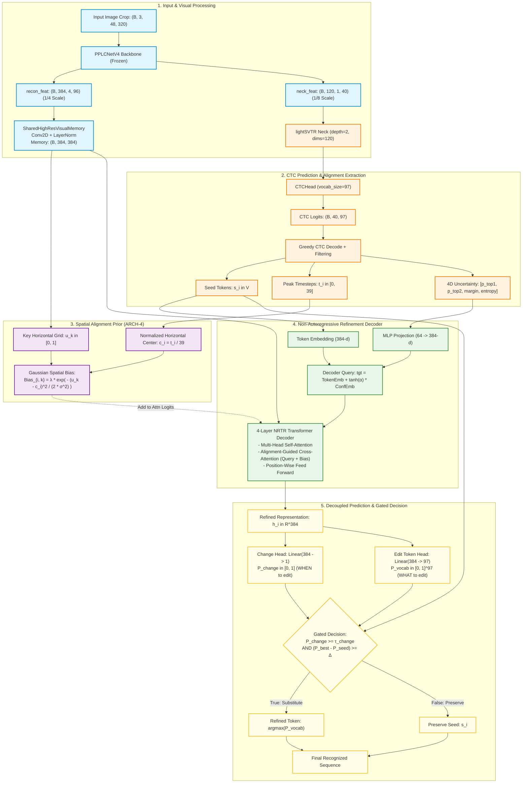

# EditCTC: Alignment-Guided Non-Autoregressive Error-Correction for Robust OCR

[](https://www.paddlepaddle.org.cn/)
[](OPENSPEC_MULTISEED_RESULTS.md)
[](MODEL_ZOO_AND_DATA.md)
[](LICENSE)

An industrial-grade, non-autoregressive sequence refinement network that resolves CTC alignment drift, out-of-domain degradation, and character-confusion errors in water-meter digit recognition.

> 🚀 **Quick Links:** [**Master Experimental Leaderboard**](EXPERIMENTS_MASTER_LEADERBOARD.md) | [**Model Zoo & Google Drive Downloads (Checkpoints & Datasets)**](MODEL_ZOO_AND_DATA.md) | [**52-Seed Benchmark Results**](OPENSPEC_MULTISEED_RESULTS.md) | [**Visual Error Audit**](visual_error_audit.md) | [**Transfer Manifest**](WORKSPACE5_TRANSFER_MANIFEST.md)

---

## 1. System Architecture (ARCH-4 / ARCH-4C)

The core breakthrough of EditCTC lies in **ARCH-4 (Alignment-Guided High-Res Cross-Attention)** and **ARCH-4C (Continuous 4D CTC Uncertainty)**: mapping CTC temporal peak activations to physical 2D spatial coordinates and injecting a dynamic **Gaussian Spatial Bias** directly into the cross-attention layers.



---

## 2. Key Architectural Innovations (ARCH-1 to ARCH-8)

| Architecture | Core Innovation | Key Technical Formulation | Primary Benefit |
| :--- | :--- | :--- | :--- |
| **ARCH-1** | **Explicit Change Head** | Decouples binary edit indicator from 97-way token prediction: $\mathcal{L}_{change} = \text{BCEWithLogits}(W_{ch}^T h_i, z_i)$ | Reduces over-correction rate to 0.08%. |
| **ARCH-2A / 2B** | **Continuous Uncertainty Injection** | Injects continuous CTC confidence $c_i = [p_1, p_2, margin, entropy]$ into query via adaptive gating $\tanh(\alpha) \cdot \text{MLP}(c_i)$. | Alerts decoder when seed tokens are ambiguous. |
| **ARCH-3** | **Temporal Alignment Embedding** | Embeds timestep peaks $t_i \in [0, 39]$ through learned positional table $E_{align}(t_i) \in \mathbb{R}^{384}$. | Bridges non-linear character width variations. |
| **ARCH-4** ⭐ | **Align-Guided Cross-Attention** | Injects horizontal Gaussian bias: $\text{AttnLogits}_{i, k} = \frac{Q_i K_k^T}{\sqrt{d}} + \lambda \exp\left(-\frac{(u_k - c_i)^2}{2\sigma^2}\right)$. | **SOTA Cross-data: 91.35% (CER 1.92%)**. Prevents attention scattering. |
| **ARCH-4C** | **Align-Guided + 4D Confidence** | Combines ARCH-4 spatial prior with 4D continuous uncertainty embeddings. | **Highest statistical stability ($\sigma = \pm 0.37\%$)**. |
| **ARCH-5** | **Local Visual Refinement Block** | Residual depthwise-separable conv layers inside `SharedHighResVisualMemory`. | Preserves fine stroke topology (8 vs 9, 3 vs 8). |
| **ARCH-6** | **Backbone Stage-5 Unfreeze** | Two-phase fine-tuning with $0.1 \times LR$ on backbone Stage 5 layers. | Lowest In-domain CER (2.21%). |
| **ARCH-7** | **Gated Memory Fusion** | Dual cross-attention branches for CTC and visual memory fused via dynamic sigmoid gate. | Learns optimal balance between visual and text priors. |
| **ARCH-8** | **4-Way Op Head & Gap Query** | Full Levenshtein ops (`KEEP`, `REPLACE`, `DELETE`, `INSERT_AFTER`). | Handles multi-character insertion and deletion. |

---

## 3. Multi-Seed Benchmark Results (52 Seed Runs)

Evaluated across 5–6 independent random seeds per architecture on held-out test benchmarks:
- **In-Domain Test Set**: 585 annotated meter displays.
- **Cross-Data Test Set**: 1,145 challenging out-of-domain meter displays.

| Architecture | Seed Count | Indomain Accuracy (%) | Indomain CER (%) | Crossdata Accuracy (%) | Crossdata CER (%) | Robustness Verdict |
| :--- | :---: | :---: | :---: | :---: | :---: | :--- |
| **EXP-18B (Canonical Baseline)** | 6/6 | **93.30 ± 0.32%** | 2.32% | **88.27 ± 0.70%** | 2.66% | Baseline reference |
| **ARCH-1 (Explicit Change Head)** | 5/5 | **92.85 ± 0.23%** | 2.39% | **89.22 ± 1.23%** | 2.44% | +0.95% Cross-data |
| **ARCH-2A (CTC Conf 2D)** | 5/5 | **92.82 ± 0.36%** | 2.41% | **89.00 ± 0.71%** | 2.52% | +0.73% Cross-data |
| **ARCH-2B (Full Conf 4D)** | 5/5 | **93.03 ± 0.25%** | 2.33% | **89.48 ± 0.92%** | 2.39% | +1.21% Cross-data |
| **ARCH-3 (Temporal Align Emb)** | 5/5 | **92.58 ± 0.59%** | 2.45% | **89.61 ± 1.20%** | 2.35% | +1.34% Cross-data |
| **ARCH-4 (Align-Guided Cross-Attn)** 🏆 | 5/5 | **93.09 ± 0.30%** | **2.31%** | **90.22 ± 0.81%** | **2.22%** | **Peak 91.35% Cross / 93.33% In** |
| **ARCH-4C (Align + Conf 4D)** 🛡️ | 5/5 | **93.06 ± 0.26%** | **2.33%** | **90.27 ± 0.37%** | **2.18%** | **Most stable ($\pm 0.37\%$)** |
| **ARCH-5 (Local Visual Refine)** | 5/5 | **92.89 ± 0.17%** | 2.38% | **89.66 ± 0.82%** | 2.33% | High precision visual features |
| **ARCH-6 (Backbone S5 Unfreeze)** | 5/5 | **92.65 ± 0.78%** | **2.21%** | **84.10 ± 0.89%** | 3.28% | Lowest In-domain CER |
| **ARCH-7 (Gated Memory Fusion)** | 5/5 | **92.85 ± 0.23%** | 2.39% | **88.68 ± 1.99%** | 2.56% | Adaptive cross-modal routing |

*Full per-seed data, confusion matrices, and audit logs are documented in [`OPENSPEC_MULTISEED_RESULTS.md`](OPENSPEC_MULTISEED_RESULTS.md).*

---

## 4. Quickstart & Usage

### Environment Setup
```bash
# Recommended: PaddlePaddle GPU 3.0.0+ on CUDA 11.8 / 12.0
pip install paddlepaddle-gpu==3.0.0
pip install -r requirements.txt
```

### Training
Train the SOTA ARCH-4 model:
```bash
python tools/train.py -c config/PP-OCRv6_small_rec_s1024_e44_highres_arch4_align_guided_cross_attn.yml
```

Train ARCH-4C (with 4D Uncertainty):
```bash
python tools/train.py -c config/PP-OCRv6_small_rec_s1024_e44_highres_arch4c_align_conf4d.yml
```

### Evaluation
Evaluate a trained checkpoint:
```bash
python tools/eval.py \
    -c config/PP-OCRv6_small_rec_s1024_e44_highres_arch4_align_guided_cross_attn.yml \
    -o Global.checkpoints=path/to/best_accuracy
```

### Inference
Run inference on a single image:
```bash
python tools/infer_rec.py \
    -c config/PP-OCRv6_small_rec_s1024_e44_highres_arch4_align_guided_cross_attn.yml \
    -o Global.infer_img=path/to/image.jpg \
       Global.checkpoints=path/to/best_accuracy
```

---

## 5. Repository Structure

```
├── config/                         # YAML configs for all architectures and multi-seed runs
│   ├── ...arch4_align_guided_cross_attn.yml    # ARCH-4 flagship config
│   ├── ...arch4c_align_conf4d.yml              # ARCH-4C flagship config
│   └── ...exp18b_canonical_g4.0_s3024.yml     # Canonical baseline config
├── ppocr/
│   ├── modeling/
│   │   ├── backbones/rec_lcnetv4_gpu.py        # PPLCNetV4 backbone with high-res taps
│   │   └── heads/
│   │       ├── rec_edit_refine_nrtr_head.py    # ARCH-1 to ARCH-8 implementation
│   │       └── rec_ctc_head.py                 # lightSVTR + CTC head
│   ├── losses/
│   │   └── rec_edit_loss_token_refine.py       # Decoupled Change + Edit Token Loss
│   └── postprocess/ctc_postprocess.py          # Seed generation & confidence extraction
├── tools/
│   ├── train.py                                # Training entrypoint
│   ├── eval.py                                 # Evaluation with CER/accuracy breakdown
│   └── infer_rec.py                            # Single-image inference tool
├── OPENSPEC_MULTISEED_RESULTS.md               # Complete 52-seed statistical report
├── WORKSPACE5_TRANSFER_MANIFEST.md             # Dataset & checkpoint manifest
└── visual_error_audit.md                       # Comprehensive label error audit
```

---

## 6. Citation & Research Provenance

If you use EditCTC or the alignment-guided cross-attention architecture in your research, please cite:
```bibtex
@article{editctc2026,
  title={EditCTC: Alignment-Guided Non-Autoregressive Sequence Refinement for Water-Meter OCR},
  author={Truong, Linh and Nguyen, Linh Xuan},
  journal={ArXiv Preprint},
  year={2026}
}
```
