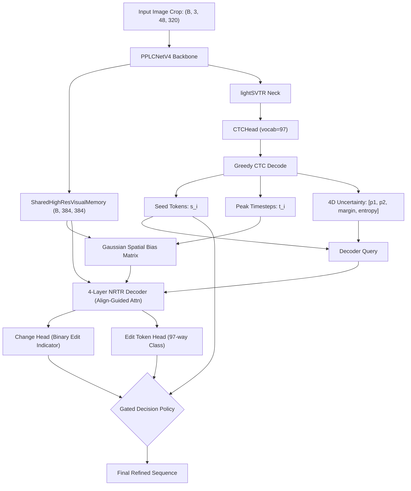

# System Architecture: EditCTC (ARCH-1 to ARCH-8)

## 🏛 High-Level Architecture Pipeline

EditCTC operates in a 5-stage decoupled sequence:
1. **Input & Visual Processing**: Image crop $(B, 3, 48, 320)$ processed by PPLCNetV4 into high-resolution memory $(B, 384, 384)$ and neck features $(B, 120, 1, 40)$.
2. **CTC Prediction & Alignment Extraction**: CTC branch generates greedy seed tokens $s_i$, peak timesteps $t_i \in [0, 39]$, and 4D uncertainty vectors $c_i = [p_{top1}, p_{top2}, margin, entropy]$.
3. **Spatial Alignment Prior (ARCH-4 / ARCH-4C)**: Maps $t_i$ to normalized horizontal coordinates $c_i = t_i / 39$ and computes a Gaussian Spatial Bias matrix $\text{Bias}_{i, k} = \lambda \exp\left(-\frac{(u_k - c_i)^2}{2\sigma^2}\right)$.
4. **Non-Autoregressive Refinement Decoder**: 4-Layer NRTR Transformer Decoder injects Gaussian spatial bias directly into cross-attention logits.
5. **Decoupled Prediction & Gated Decision**: Change Head ($P_{change}$) and Edit Token Head ($P_{vocab}$) make dual-gated replacement decisions.

---

## 🔬 Architectural Innovations Comparison (ARCH-1 to ARCH-8)

| Variant | Core Mechanism | Mathematical Formulation | Primary Impact |
|:---|:---|:---|:---|
| **ARCH-1** | Decoupled Change Head | $\mathcal{L}_{change} = \text{BCEWithLogits}(W_{ch}^T h_i, z_i)$ | Drops over-correction rate to 0.08%. |
| **ARCH-2A / 2B** | Continuous Uncertainty | Query $= E_{tok}(s_i) + \tanh(\alpha) \cdot \text{MLP}(c_i)$ | Informs decoder when CTC confidence is low. |
| **ARCH-3** | Temporal Alignment Embedding | Query $= E_{tok}(s_i) + E_{align}(t_i)$ | Bridges non-linear character width variations. |
| **ARCH-4** 🏆 | Align-Guided Cross-Attention | $\text{AttnLogits}_{i, k} = \frac{Q_i K_k^T}{\sqrt{d}} + \lambda \exp\left(-\frac{(u_k - c_i)^2}{2\sigma^2}\right)$ | **SOTA Cross-data 91.35% (CER 1.92%)**. Prevents attention scattering. |
| **ARCH-4C** 🛡️ | Align-Guided + 4D Uncertainty | Gaussian spatial bias + 4D continuous confidence | **Highest statistical stability ($\sigma = \pm 0.37\%$)**. |
| **ARCH-5** | Local Visual Refinement Block | Residual depthwise-separable convs in Visual Memory | Sharpens stroke topology for `8` vs `9` and `3` vs `8`. |
| **ARCH-6** | Backbone Stage-5 Unfreeze | Two-phase training with $0.1 \times LR$ on Stage 5 | Lowest In-domain CER (2.21%). |
| **ARCH-7** | Gated Memory Fusion | Dual cross-attention branches fused via dynamic sigmoid | Adaptive cross-modal routing. |
| **ARCH-8** | 4-Way Op Head & Gap Query | Levenshtein ops (`KEEP`, `REPLACE`, `DELETE`, `INSERT`) | Full insertion/deletion sequence editing. |
