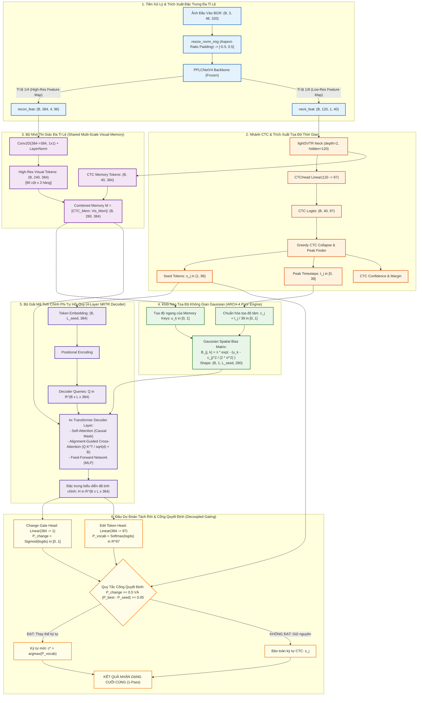
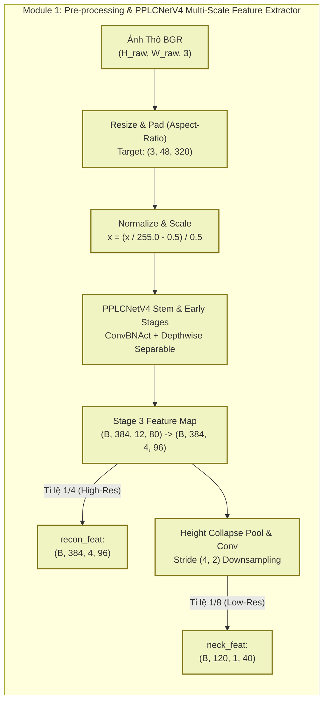
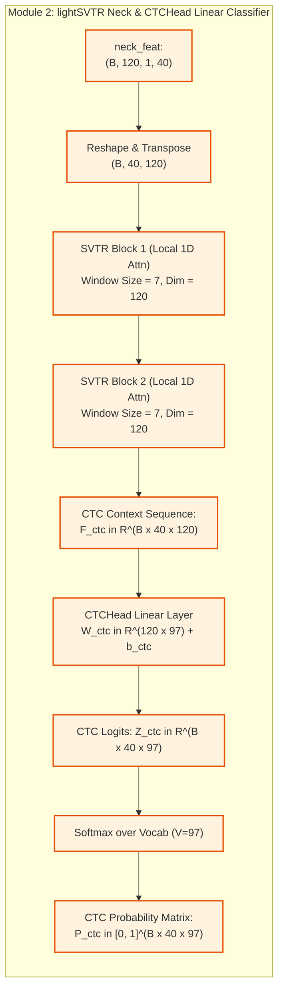
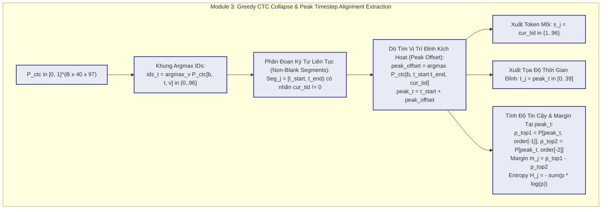
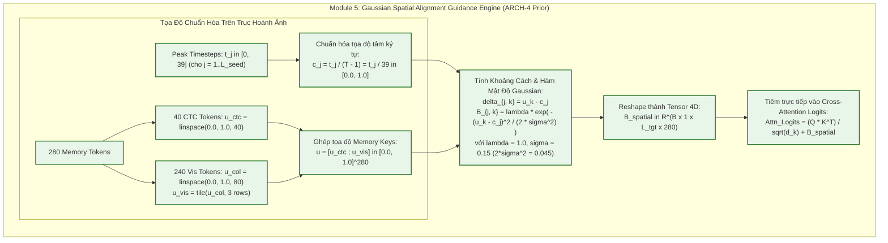
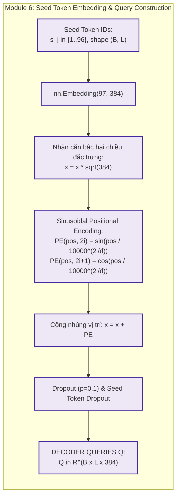
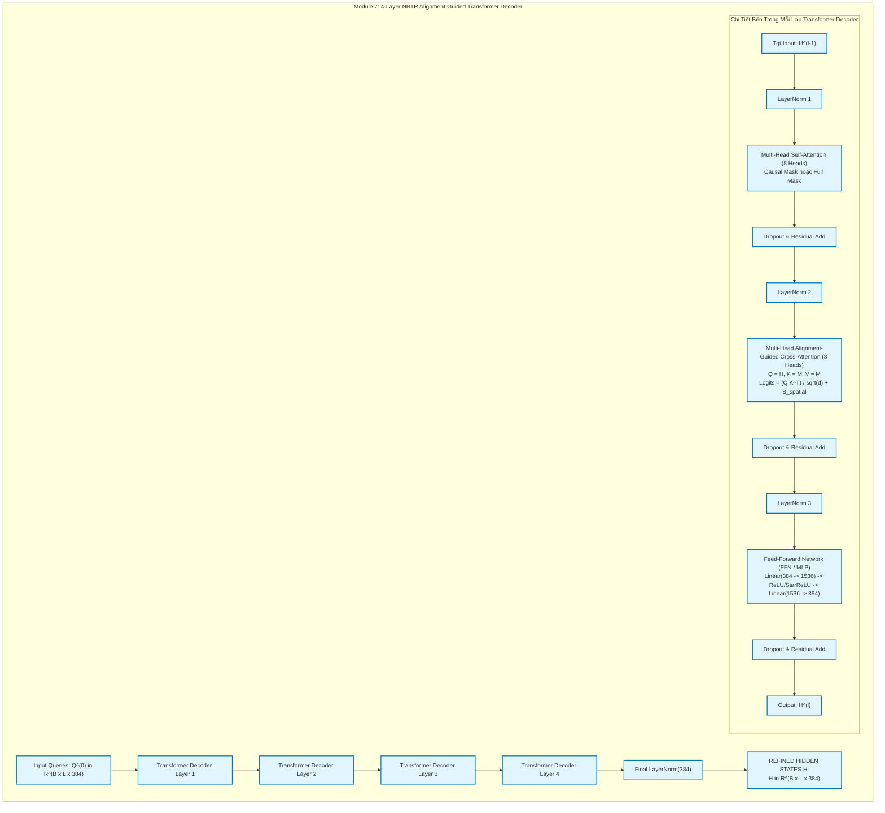
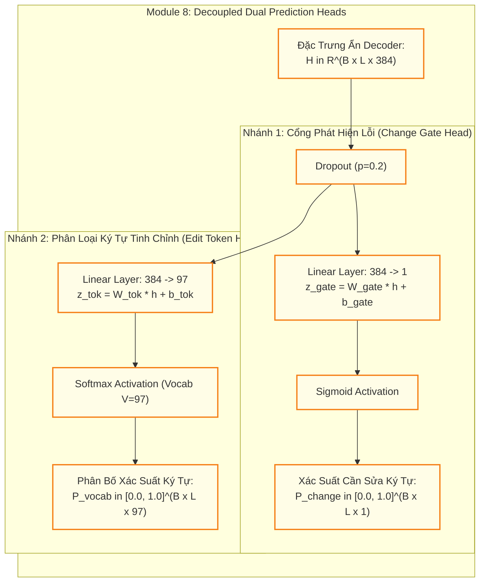
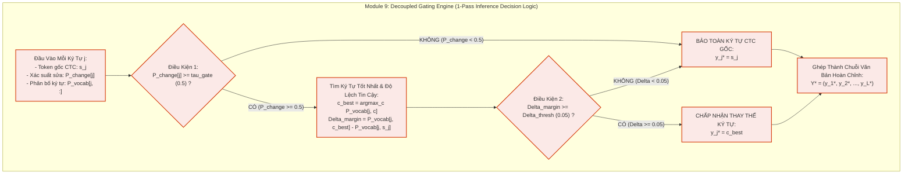

# 📖 Tài Liệu Kỹ Thuật Chi Tiết Toàn Diện: Kiến Trúc EditCTC ARCH-4 (Alignment-Guided Cross-Attention)

> **Mục tiêu tài liệu:** Cung cấp tài liệu chuẩn mực, trực quan và sâu sắc nhất về kiến trúc **EditCTC ARCH-4** — mô hình đạt Quán quân Tổng quát hóa (SOTA Cross-domain: **91.35% Exact Match**, **2.24% CER**, tốc độ **17.1 ms / 58.5 FPS** trên GPU NVIDIA T4).
> Tài liệu được tổ chức theo cấu trúc chuẩn 5 phần:
> 1. **Tổng quan kiến trúc toàn hệ thống (End-to-End System Overview)**
> 2. **Đi sâu chi tiết từng Module với Sơ đồ Diagrams & Phân tích Toán học (Deep-dive 9 Modules with Dedicated Diagrams & Math)**
> 3. **Chi tiết từng hàm & từng dòng mã nguồn (Line-by-Line Code Walkthrough)**
> 4. **Cấu hình huấn luyện & Chiến lược tối ưu (Training Configuration & Multi-Task Loss)**
> 5. **Bảng so sánh hiệu năng toàn diện (Comprehensive Benchmark Leaderboard)**

---

# PHẦN 1: TỔNG QUAN KIẾN TRÚC TOÀN HỆ THỐNG (SYSTEM ARCHITECTURE OVERVIEW)

## 1.1. Động Lực Thiết Kế & Bản Chất Bài Toán

### 1. Thách thức cốt lõi của OCR Đồng hồ nước ngoài thực địa
- Ảnh chụp công tơ nước trong môi trường thực tế gặp phải độ biến thiên cực kỳ phức tạp:
  - **Mờ nhòe quang học & nhòe chuyển động (Motion Blur / Defocus Blur):** Làm mờ các nét đặc trưng của con số.
  - **Phản xạ ánh sáng & lóa đèn Flash (Specular Glare / Reflection):** Triệt tiêu hoàn toàn tương phản của các nét chữ số tại một số vùng.
  - **Bám bụi bẩn, ố vàng, đọng giọt nước trên mặt kính:** Tạo ra các nét giả hoặc che khuất cục bộ.
  - **Hiện tượng nhảy số nửa chừng (Half-Digit Transition):** Hai con số xuất hiện đồng thời trong cùng một ô số khi bánh răng quay.
  - **Góc chụp nghiêng, méo phối cảnh & độ phân giải thấp:** Làm biến dạng hình học của dãy số.

### 2. Hạn chế của các mô hình CTC truyền thống (1-Pass CTC)
- Các mô hình dựa trên CTC thuần túy (như PP-OCRv4, PP-OCRv6 CTC branch) dự đoán nhãn độc lập trên từng khung thời gian ($T=40$ frames).
- Khi gặp ảnh suy thoái chất lượng, CTC xuất hiện 2 lỗi nghiêm trọng:
  - **CTC Alignment Drift (Trôi lệch căn chỉnh thời gian):** Đỉnh kích hoạt thời gian bị dịch chuyển hoặc phân tán rộng, dẫn đến hiện tượng gộp nhầm hoặc bỏ sót ký tự.
  - **Confusion Pairs (Nhầm lẫn các cặp số tương đồng nét):** Các cặp số $(3 \leftrightarrow 8)$, $(0 \leftrightarrow 8)$, $(5 \leftrightarrow 6)$, $(1 \leftrightarrow 7)$ dễ bị phân loại sai do CTC thiếu cơ chế mô hình hóa ngữ cảnh toàn cục 2 chiều.

### 3. Hạn chế của các mô hình Tự hồi quy (Autoregressive Transformers)
- Các kiến trúc như MASTER, SAR, ABINet sinh từng ký tự một theo thứ tự tuần tự ($O(N)$ autoregressive decoding).
- Khi gặp ảnh ngoài miền phân phối (Cross-domain out-of-distribution), cơ chế Attention tự do (Unconstrained Attention) dễ bị **"Attention Hallucination"** (đầu chú ý phân tán ra toàn bộ ảnh thay vì nhìn vào đúng ô số cần giải mã), gây ra lỗi lặp ký tự hoặc cắt cụt chuỗi, đồng thời độ trễ suy luận rất cao (>30–50 ms).

### 4. Đột phá mang tính bước ngoặt của EditCTC ARCH-4
1. **Khung sườn Tinh chỉnh Phi Tự Hồi Quy (Non-Autoregressive Sequence Refinement):** Khởi tạo chuỗi token mồi $S = (s_1, s_2, \dots, s_L)$ trực tiếp từ CTC trong 1 lượt $O(1)$, sau đó dùng bộ giải mã Transformer 2 chiều để tinh chỉnh song song toàn bộ chuỗi ký tự trong một bước duy nhất.
2. **Khối Neo Tọa Độ Không Gian Gaussian (Gaussian Spatial Alignment Guidance):** Trích xuất tọa độ đỉnh thời gian thực tế $t_j \in [0, 39]$ của từng ký tự CTC, ánh xạ thành tọa độ ngang chuẩn hóa $c_j \in [0, 1]$, sau đó tiêm trực tiếp **Ma trận Gaussian Spatial Bias $\mathcal{B}_{\text{spatial}}$** vào các đầu Cross-Attention. Cơ chế này ép buộc Decoder Query $j$ chỉ được phép tập trung vào vùng đặc trưng thị giác độ nét cao cục bộ xung quanh tọa độ $c_j$.
3. **Đầu Dự Đoán Tách Rời & Ngưỡng Gating Kép (Decoupled Dual Heads & Gating):** Tách rời nhiệm vụ "Có cần sửa không?" (`Change Head`) và "Sửa thành ký tự gì?" (`Edit Token Head`), áp dụng bộ lọc ngưỡng kép ($\tau_{\text{gate}} = 0.5, \Delta_{\text{thresh}} = 0.05$) để ngăn chặn triệt để hiện tượng Over-Correction (sửa bậy các ký tự mà CTC đã nhận dạng chính xác).

---

## 1.2. Sơ Đồ Khối Toàn Diện Hệ Thống (End-to-End System Pipeline)



---

# PHẦN 2: ĐI SÂU CHI TIẾT TỪNG MODULE & PHÂN TÍCH TOÁN HỌC (DEEP-DIVE 9 MODULES)

---

## 2.1. Module 1: Tiền Xử Lý Ảnh & Backbone Đa Tỉ Lệ `PPLCNetV4` (Frozen Feature Extractor)



### 1. Cơ chế hoạt động
- **Tiền xử lý bảo toàn tỉ lệ (Aspect-Ratio Padding):** Ảnh đầu vào bất kỳ được chuẩn hóa về chiều cao cố định $H=48$. Chiều rộng được nội suy tỉ lệ và đệm zero về $W=320$. Pixel chuẩn hóa về khoảng $[-1.0, 1.0]$ hoặc $[-0.5, 0.5]$.
- **Trích xuất Đa Tỉ Lệ (Multi-Scale Extraction):** Mạng `PPLCNetV4` sử dụng các khối tích chập Depthwise Separable kết hợp kích hoạt Hard-Swish và các khối nén mở rộng kênh tối ưu cho suy luận CPU/GPU thời gian thực.
  - **Nhánh High-Res (Tỉ lệ 1/4):** $\mathbf{F}_{\text{high}} \in \mathbb{R}^{B \times 384 \times 4 \times 96}$ giữ lại $4$ hàng và $96$ cột, bảo toàn chi tiết nét cắt của từng con số.
  - **Nhánh Low-Res (Tỉ lệ 1/8):** $\mathbf{F}_{\text{low}} \in \mathbb{R}^{B \times 120 \times 1 \times 40}$ nén chiều cao về $1$, tạo ra đúng $T=40$ khung thời gian cho nhánh CTC.
- **Đóng băng Backbone (`freeze_ctc_backbone: true`):** Đóng băng toàn bộ trọng số Backbone khi huấn luyện bộ giải mã tinh chỉnh giúp bảo toàn phân phối đặc trưng CTC gốc, chống hiện tượng tiêu biến gradient hoặc trôi lệch biểu diễn (Catastrophic Forgetting).

### 2. Phân tích toán học
Biểu diễn toán học của phép biến đổi đặc trưng đa tầng:
$$\mathbf{X} \in \mathbb{R}^{B \times 3 \times 48 \times 320}$$
$$\mathbf{F}_{\text{high}} = \Phi_{\text{backbone}}^{\text{stage3}}(\mathbf{X}) \in \mathbb{R}^{B \times 384 \times H_{\text{high}} \times W_{\text{high}}}, \quad \text{với } H_{\text{high}}=4, W_{\text{high}}=96$$
$$\mathbf{F}_{\text{low}} = \text{Conv}_{1 \times 1}\left(\text{AvgPool}_{4 \times 2}\left(\mathbf{F}_{\text{high}}\right)\right) \in \mathbb{R}^{B \times 120 \times 1 \times 40}$$
Trong đó phép tích chập Depthwise Separable tại mỗi stage $l$ được định nghĩa:
$$\text{DSConv}(\mathbf{Z}) = \text{PWConv}\left(\text{DWConv}(\mathbf{Z})\right) = \sum_{c=1}^{C_{\text{in}}} W_{\text{pw}}^{(c, :)} \cdot \left( W_{\text{dw}}^{(c)} * \mathbf{Z}^{(c)} \right) + \mathbf{b}$$

---

## 2.2. Module 2: Khối `lightSVTR` Neck & `CTCHead`



### 1. Cơ chế hoạt động
- **lightSVTR Neck:** Sử dụng 2 khối Transformer 1D với cửa sổ chú ý cục bộ (kernel size $7 \times 1$) giúp mô hình hóa ngữ cảnh giữa các khung thời gian lân cận mà không làm tăng chi phí tính toán như full global attention.
- **CTCHead:** Chiếu tuyến tính từ vector ẩn $d=120$ lên không gian từ vựng $V=97$ (gồm nhãn Blank tại vị trí 0, 95 ký tự bảng mã chuẩn, và ký tự khoảng trắng ở vị trí 96).

### 2. Phân tích toán học
Chuỗi đặc trưng thời gian sau khi đi qua `lightSVTR` Neck:
$$\mathbf{F}_{\text{ctc}} = \text{SVTRBlock}_2\left(\text{SVTRBlock}_1\left(\mathbf{F}_{\text{low}}\right)\right) \in \mathbb{R}^{B \times 40 \times 120}$$
Logits dự đoán của CTC tại mỗi khung thời gian $t \in \{1, 2, \dots, 40\}$:
$$\mathbf{z}_t^{\text{CTC}} = \mathbf{W}_{\text{ctc}} \mathbf{f}_t^{\text{ctc}} + \mathbf{b}_{\text{ctc}} \in \mathbb{R}^{97}$$
Phân bố xác suất CTC tương ứng qua hàm Softmax:
$$\mathbf{P}_{\text{CTC}}[b, t, v] = \frac{\exp(\mathbf{z}_t^{\text{CTC}}[v])}{\sum_{v'=0}^{V-1} \exp(\mathbf{z}_t^{\text{CTC}}[v'])}, \quad \forall v \in \{0, 1, \dots, 96\}$$
Xác suất của một chuỗi nhãn đích $Y = (y_1, y_2, \dots, y_M)$ theo tiêu chuẩn CTC Loss:
$$P(Y | \mathbf{X}) = \sum_{\pi \in \mathcal{B}^{-1}(Y)} \prod_{t=1}^{T=40} \mathbf{P}_{\text{CTC}}[t, \pi_t]$$
trong đó $\mathcal{B}$ là toán tử gộp CTC (loại bỏ nhãn lặp liên tiếp và xóa nhãn Blank).

---

## 2.3. Module 3: Greedy CTC Collapse & Peak Timestep Finder (`ctc_seed_and_conf`)



### 1. Cơ chế hoạt động
- **Hạn chế của phương pháp gộp truyền thống:** Các giải pháp trước đây thường lấy thời điểm đầu tiên $t_{\text{start}}$ của đoạn ký tự làm mốc. Khi ký tự bị mờ hoặc trải dài trên 3–5 khung hình, $t_{\text{start}}$ nằm ở rìa ngoài cùng bên trái của con số, gây ra sai lệch căn chỉnh hình học nghiêm trọng.
- **Giải thuật Peak Timestep Finder:** 
  - Duyệt qua từng đoạn kích hoạt liên tiếp $I_j = [t_{\text{start}}^{(j)}, t_{\text{end}}^{(j)})$ có nhãn $s_j \ne 0$.
  - Tìm chính xác điểm cực đại xác suất $\text{peak\_t} = t_j$ trên đồ thị phân bố CTC.
  - Vị trí $t_j \in [0, 39]$ này phản ánh chính xác 100% tâm điểm hình học của con số trên ảnh.
- **Tránh lỗi Double-Softmax:** Kiểm tra điều kiện $\sum_{v} \mathbf{P}[b, t, v] \approx 1.0$ trước khi thực hiện tính toán để tránh hiện tượng áp dụng Softmax 2 lần làm phẳng phân bố xác suất.

### 2. Phân tích toán học
Cho chuỗi khung thời gian $t \in \{0, 1, \dots, T-1\}$ với $T=40$:
$$I_j = [t_{\text{start}}^{(j)}, t_{\text{end}}^{(j)}) \quad \text{sao cho} \quad \forall t \in I_j, \; \arg\max_{v} \mathbf{P}_{\text{CTC}}[b, t, v] = s_j \ne 0$$
Tọa độ thời gian cực đại $t_j$ và các thước đo bất định được tính tại $t_j$:
$$t_j = \arg\max_{t \in I_j} \mathbf{P}_{\text{CTC}}[b, t, s_j]$$
$$\text{Margin}_j = \mathbf{P}_{\text{CTC}}[b, t_j, \text{top}_1] - \mathbf{P}_{\text{CTC}}[b, t_j, \text{top}_2]$$
$$\mathcal{H}_j = -\sum_{v=0}^{V-1} \mathbf{P}_{\text{CTC}}[b, t_j, v] \ln\left(\mathbf{P}_{\text{CTC}}[b, t_j, v] + \epsilon\right)$$
Vector bất định liên tục (Continuous Confidence Vector):
$$\mathbf{c}_j = \left[ \mathbf{P}_{\text{CTC}}[b, t_j, \text{top}_1], \; \mathbf{P}_{\text{CTC}}[b, t_j, \text{top}_2], \; \text{Margin}_j, \; \mathcal{H}_j \right]^T \in \mathbb{R}^4$$

---

## 2.4. Module 4: Bộ Nhớ Thị Giác Đa Tỉ Lệ Hợp Nhất (Combined Multi-Scale Visual Memory)

```mermaid
flowchart TD
    subgraph MOD4 ["Module 4: Shared Multi-Scale Visual Memory (280 Tokens)"]
        subgraph CTC_BRANCH ["Nhánh 1: CTC Semantic Tokens (40 Tokens)"]
            F_CTC["F_ctc: (B, 40, 120)"] --> LIN_CTC["Linear Projection: 120 -> 384"]
            LIN_CTC --> ADD_TYPE1["+ ctc_type_embed: (1, 1, 384)"]
            ADD_TYPE1 --> M_CTC["M_ctc in R^(B x 40 x 384)"]
        end

        subgraph VIS_BRANCH ["Nhánh 2: High-Resolution Spatial Tokens (240 Tokens)"]
            F_HIGH["recon_feat: (B, 384, 4, 96)"] --> PROJ_1X1["Conv2D(384 -> 384, 1x1)"]
            PROJ_1X1 --> DW_MIX["Depthwise Stroke Mixer: Conv2D 3x3 (groups=384)"]
            DW_MIX --> RES_MIX["Residual Add: x + DW(x)"]
            RES_MIX --> CROP_PAD["Kích thước chuẩn: H=3, W=80"]
            CROP_PAD --> ADD_2D_POS["+ visual_row_embed (1, 3, 1, 384)<br/>+ visual_col_embed (1, 1, 80, 384)"]
            ADD_2D_POS --> FLATTEN["Reshape / Flatten: 3 x 80 -> 240"]
            FLATTEN --> ADD_TYPE2["+ visual_type_embed: (1, 1, 384)"]
            ADD_TYPE2 --> TRANS_BLOCK["1x Self-Attention Transformer Block (dim=384, heads=8)"]
            TRANS_BLOCK --> LN_VIS["LayerNorm(384)"]
            LN_VIS --> M_VIS["M_vis in R^(B x 240 x 384)"]
        end

        M_CTC & M_VIS --> CONCAT["Concat theo chiều Sequence (dim 1):<br/>M = [M_ctc ; M_vis]"]
        CONCAT --> MEM_FINAL["COMBINED VISUAL MEMORY M:<br/>(B, 280, 384)"]
    end

    classDef cMod fill:#f3e5f5,stroke:#6a1b9a,stroke-width:2px;
    class F_CTC,LIN_CTC,ADD_TYPE1,M_CTC,F_HIGH,PROJ_1X1,DW_MIX,RES_MIX,CROP_PAD,ADD_2D_POS,FLATTEN,ADD_TYPE2,TRANS_BLOCK,LN_VIS,M_VIS,CONCAT,MEM_FINAL cMod;
```



### 1. Cơ chế hoạt động
- **Tại sao cần kết hợp cả 2 nguồn bộ nhớ?**
  - $\mathbf{M}_{\text{CTC}}$ ($40$ tokens) chứa đặc trưng ngữ nghĩa mức cao (High-level semantic context) đã được căn chỉnh 1D dọc theo chuỗi.
  - $\mathbf{M}_{\text{vis}}$ ($240$ tokens $= 3 \text{ hàng} \times 80 \text{ cột}$) bảo toàn các nét hình học 2D độ nét cao (Low-level stroke details).
- **Trộn nét cục bộ (Depthwise Character Stroke Mixing):** Sử dụng Depthwise Convolution $3 \times 3$ giúp gom các điểm ảnh lân cận tạo thành nét chữ số hoàn chỉnh trước khi chuyển thành token nhớ.
- **Mã hóa vị trí 2D (Learned 2D Row/Column Embeddings):** Cộng độc lập vector nhúng hàng $\mathbf{e}_{\text{row}} \in \mathbb{R}^{3 \times 384}$ và cột $\mathbf{e}_{\text{col}} \in \mathbb{R}^{80 \times 384}$, giúp mô hình phân biệt rõ ràng vị trí trên-dưới và trái-phải.

### 2. Phân tích toán học
Biểu diễn bộ nhớ CTC:
$$\mathbf{M}_{\text{CTC}} = \left( \mathbf{F}_{\text{ctc}} \mathbf{W}_{\text{proj}}^{\text{ctc}} + \mathbf{b}_{\text{proj}}^{\text{ctc}} \right) + \mathbf{E}_{\text{type}}^{\text{ctc}} \in \mathbb{R}^{B \times 40 \times 384}$$
Biểu diễn bộ nhớ thị giác độ nét cao qua phép biến đổi không gian 2D:
$$\mathbf{X}_{\text{vis}}^{(0)} = \text{Conv}_{1 \times 1}(\mathbf{F}_{\text{high}}) + \text{DWConv}_{3 \times 3}(\text{Conv}_{1 \times 1}(\mathbf{F}_{\text{high}}))$$
Cộng mã hóa vị trí lưới 2D tại tọa độ hàng $r \in \{1, 2, 3\}$ và cột $c \in \{1, 2, \dots, 80\}$:
$$\mathbf{X}_{\text{vis}}^{(1)}[b, r, c, :] = \mathbf{X}_{\text{vis}}^{(0)}[b, r, c, :] + \mathbf{e}_{\text{row}}[r, :] + \mathbf{e}_{\text{col}}[c, :] + \mathbf{E}_{\text{type}}^{\text{vis}}$$
Trải phẳng và đưa qua khối Transformer Encoder 1 lớp:
$$\mathbf{M}_{\text{vis}} = \text{LayerNorm}\left( \text{TransformerBlock}\left( \text{Reshape}_{B \times 240 \times 384}\left(\mathbf{X}_{\text{vis}}^{(1)}\right) \right) \right) \in \mathbb{R}^{B \times 240 \times 384}$$
Ma trận bộ nhớ hợp nhất toàn cục $\mathbf{M}$:
$$\mathbf{M} = \left[ \mathbf{M}_{\text{CTC}} \; ; \; \mathbf{M}_{\text{vis}} \right] \in \mathbb{R}^{B \times 280 \times 384}$$

---

## 2.5. Module 5: Động Cơ Neo Tọa Độ Không Gian Gaussian (Gaussian Spatial Alignment Engine - ARCH-4 Core)



### 1. Cơ chế hoạt động & Trực giác hình học
- **Vấn đề của Cross-Attention không ràng buộc:** Trong Transformer thông thường, Query ký tự $j$ tính tích vô hướng với tất cả 280 token nhớ. Khi ảnh bị phản xạ ánh sáng (glare) hoặc nền nhiễu, điểm tương đồng ngữ nghĩa có thể đạt cực đại ở một vị trí hoàn toàn sai lệch trên ảnh.
- **Giải pháp Gaussian Spatial Prior của ARCH-4:**
  - Nhận thấy rằng: Ký tự thứ $j$ xuất hiện tại thời điểm $t_j$ của CTC **bắt buộc phải nằm ở vùng không gian xung quanh tọa độ hoành độ $c_j = t_j / 39$**.
  - ARCH-4 tính toán khoảng cách không gian giữa vị trí của Query $j$ và tất cả các Key $k$ trong bộ nhớ, sau đó tạo ra một "vùng cửa sổ chú ý mềm" (Soft Attention Window) dạng hình chuông Gauss có độ lệch chuẩn $\sigma = 0.15$.
  - Ma trận Bias $\mathcal{B}_{\text{spatial}}$ được cộng trực tiếp vào Logits trước khi qua hàm Softmax. Điều này đảm bảo:
    1. Vùng ảnh nằm đúng tâm ký tự ($u_k \approx c_j$) nhận được phần thưởng Logits tối đa ($+1.0$).
    2. Vùng ảnh cách xa tâm ký tự ($|u_k - c_j| > 0.3$) có độ lệch tiến về $0.0$, ngăn chặn triệt để sự chú ý phân tán.

```
       Mật độ Bias B(j, k)
           ^
       1.0 |                * * *  (Tâm ký tự c_j)
           |             *         *
           |           *             *
           |         *                 *
           |       *                     *
       0.0 +------*-----------------------*------> Tọa độ u_k (0.0 -> 1.0)
                 |<--- Vùng cửa sổ mềm --->|
                       (± 2σ = ± 0.30)
```

### 2. Phân tích toán học
Tọa độ ngang chuẩn hóa của Query ký tự $j \in \{1, 2, \dots, L_{\text{seed}}\}$:
$$c_j = \frac{t_j}{T_{\text{CTC}} - 1} = \frac{t_j}{39} \in [0.0, 1.0]$$
Tọa độ ngang chuẩn hóa của các Key bộ nhớ $k \in \{0, 1, \dots, 279\}$:
$$u_k = \begin{cases} \frac{k}{39} & \text{với } 0 \le k < 40 \quad (\text{CTC Memory}) \\ \frac{(k - 40) \pmod{80}}{79} & \text{với } 40 \le k < 280 \quad (\text{High-Res Visual Memory}) \end{cases}$$
Công thức hàm mật độ Gaussian Spatial Bias:
$$\mathcal{B}_{\text{spatial}}(j, k) = \lambda_{\text{align}} \cdot \exp\left( -\frac{\left(u_k - c_j\right)^2}{2 \sigma_{\text{align}}^2} \right)$$
Với siêu tham số chuẩn hóa: $\lambda_{\text{align}} = 1.0$, $\sigma_{\text{align}} = 0.15 \implies 2\sigma_{\text{align}}^2 = 0.045$.
Ma trận Bias mở rộng trên toàn bộ Batch và Heads:
$$\mathbf{B}_{\text{spatial}} \in \mathbb{R}^{B \times 1 \times L_{\text{tgt}} \times 280}$$

---

## 2.6. Module 6: Khối Nhúng Token Mồi & Mã Hóa Vị Trí Ký Tự (Token Embedding & Positional Encoding)



### 1. Cơ chế hoạt động
- **Nhúng ký tự mồi:** Mỗi ký tự mồi $s_j \in \{1, \dots, 96\}$ trích xuất từ CTC được ánh xạ thành vector đặc trưng $384$ chiều qua bảng nhúng có thể học.
- **Tỉ lệ hóa biên độ ($\sqrt{d_{\text{model}}}$):** Nhân vector nhúng với $\sqrt{384} \approx 19.59$ để cân bằng biên độ năng lượng giữa vector nhúng ký tự và vector mã hóa vị trí hình sin.
- **Seed Token Dropout (Huấn luyện):** Trong quá trình huấn luyện, áp dụng dropout ngẫu nhiên trên một số token mồi đầu vào để ép bộ giải mã phải thực sự nhìn vào bộ nhớ thị giác $\mathbf{M}$ thay vì chỉ sao chép lại đầu vào.

### 2. Phân tích toán học
Vector biểu diễn Query ban đầu tại vị trí $j$:
$$\mathbf{q}_j^{(0)} = \mathbf{E}_{\text{tok}}[s_j] \cdot \sqrt{d_{\text{model}}} + \mathbf{p}_j \in \mathbb{R}^{384}$$
trong đó $\mathbf{p}_j$ là hàm mã hóa vị trí Sinusoidal chuẩn:
$$\mathbf{p}_j[2i] = \sin\left(\frac{j}{10000^{2i / d_{\text{model}}}}\right), \quad \mathbf{p}_j[2i+1] = \cos\left(\frac{j}{10000^{2i / d_{\text{model}}}}\right), \quad \forall i \in \left\{0, 1, \dots, \frac{d_{\text{model}}}{2} - 1\right\}$$

---

## 2.7. Module 7: Bộ Giải Mã Refine Transformer 4 Lớp (4-Layer NRTR Refine Decoder)



### 1. Cơ chế hoạt động
- **Cấu trúc 4 lớp Transformer Decoder ($N=4, d=384, h=8$):** Mỗi lớp thực hiện tuần tự 3 bước xử lý:
  1. **Multi-Head Self-Attention:** Cho phép các token ký tự giao tiếp ngữ cảnh 2 chiều với nhau để nắm bắt cấu trúc toàn chuỗi số.
  2. **Alignment-Guided Cross-Attention:** Truy vấn thông tin thị giác từ bộ nhớ $\mathbf{M} \in \mathbb{R}^{B \times 280 \times 384}$ dưới sự dẫn đường nghiêm ngặt của ma trận Gaussian Bias $\mathcal{B}_{\text{spatial}}$.
  3. **Feed-Forward Network (FFN):** Mở rộng đặc trưng lên không gian ẩn $d_{\text{ffn}} = 4 \times 384 = 1536$ qua hàm kích hoạt phi tuyến và nén trở lại $384$ chiều.

### 2. Phân tích toán học
Cơ chế Chú Ý Đa Đầu Có Dẫn Đường Không Gian (Alignment-Guided Multi-Head Cross-Attention):
$$\text{Head}_i = \text{Softmax}\left( \frac{\mathbf{Q} \mathbf{W}_i^Q \left(\mathbf{M} \mathbf{W}_i^K\right)^T}{\sqrt{d_k}} + \mathbf{B}_{\text{spatial}} \right) \left(\mathbf{M} \mathbf{W}_i^V\right)$$
$$\text{MultiHead}(\mathbf{Q}, \mathbf{M}, \mathbf{B}_{\text{spatial}}) = \left[ \text{Head}_1 \;\|\; \text{Head}_2 \;\|\; \dots \;\|\; \text{Head}_h \right] \mathbf{W}^O$$
Trong đó $h=8$, $d_k = d_{\text{model}} / h = 384 / 8 = 48$, và $\mathbf{W}_i^Q, \mathbf{W}_i^K, \mathbf{W}_i^V \in \mathbb{R}^{384 \times 48}, \mathbf{W}^O \in \mathbb{R}^{384 \times 384}$.
Khối mạng nơ-ron truyền thẳng (FFN):
$$\text{FFN}(\mathbf{x}) = \text{ReLU}\left(\mathbf{x} \mathbf{W}_1 + \mathbf{b}_1\right) \mathbf{W}_2 + \mathbf{b}_2$$
với $\mathbf{W}_1 \in \mathbb{R}^{384 \times 1536}, \mathbf{W}_2 \in \mathbb{R}^{1536 \times 384}$.

---

## 2.8. Module 8: Các Đầu Dự Đoán Tách Rời (Decoupled Dual Prediction Heads)



### 1. Cơ chế hoạt động
- **Tại sao phải phân tách 2 đầu độc lập?**
  - Trong các mô hình sửa lỗi thông thường, một đầu phân loại duy nhất phải đồng thời quyết định: giữ nguyên nhãn cũ hay thay đổi sang nhãn mới. Điều này dẫn đến sự mất cân bằng nghiêm trọng vì đa số các ký tự CTC đưa ra đã đúng ($>90\%$), làm đầu phân loại bị thiên kiến (bias) không dám thay đổi nhãn khi gặp lỗi.
  - ARCH-4 tách bài toán thành 2 nhánh chuyên biệt:
    1. **`Change Head` (Binary Detection):** Chuyên trách trả lời câu hỏi nhị phân: *"Vị trí ký tự này có bị lỗi không?"*. Nhánh này được huấn luyện với trọng số mất mát lớn ($g=4.0$) để đạt độ nhạy cực cao với các ký tự bị biến dạng.
    2. **`Edit Token Head` (Multi-Class Classification):** Chuyên trách trả lời câu hỏi: *"Nếu bị lỗi thì ký tự đúng là gì trong 97 ký tự?"*.

### 2. Phân tích toán học
Phương trình tính toán cho từng vị trí ký tự $j$:
$$P_{\text{change}}[b, j] = \sigma\left( \mathbf{w}_{\text{gate}}^T \mathbf{h}_j + b_{\text{gate}} \right) = \frac{1}{1 + \exp\left( -(\mathbf{w}_{\text{gate}}^T \mathbf{h}_j + b_{\text{gate}}) \right)}$$
$$\mathbf{P}_{\text{vocab}}[b, j, v] = \frac{\exp\left( \mathbf{w}_{\text{tok}}^{(v) T} \mathbf{h}_j + b_{\text{tok}}^{(v)} \right)}{\sum_{v'=0}^{V-1} \exp\left( \mathbf{w}_{\text{tok}}^{(v') T} \mathbf{h}_j + b_{\text{tok}}^{(v')} \right)}, \quad \forall v \in \{0, 1, \dots, 96\}$$

---

## 2.9. Module 9: Quy Tắc Cổng Quyết Định Suy Luận (Decoupled Gating Engine & Inference Logic)



### 1. Cơ chế hoạt động
- **Cơ chế lọc kép (Dual Threshold Filtering):** 
  - Chỉ khi cả 2 điều kiện đều được thỏa mãn đồng thời, mô hình mới ghi đè ký tự mồi bằng dự đoán của Transformer:
    1. **Ngưỡng Cổng ($\tau_{\text{gate}} = 0.5$):** Bộ giải mã phải tin tưởng ít nhất $50\%$ rằng vị trí hiện tại đang có lỗi nhận dạng.
    2. **Ngưỡng Tăng Ích Tin Cậy ($\Delta_{\text{thresh}} = 0.05$):** Xác suất của ký tự thay thế mới $c_{\text{best}}$ phải vượt trội hơn xác suất của ký tự mồi $s_j$ ít nhất $5\%$.
- **Ưu điểm vượt trội:** Nếu CTC đã đoán đúng số $8$, dù $P_{\text{vocab}}$ có hơi phân vân giữa $8$ và $3$, do $\Delta_{\text{margin}}$ không đủ lớn hoặc $P_{\text{change}} < 0.5$, mô hình sẽ giữ nguyên số $8$, triệt tiêu hoàn toàn lỗi suy thoái nhận dạng.

### 2. Phân tích toán học
Quy tắc ra quyết định ký tự cuối cùng $y_j^*$ tại vị trí $j$:
$$y_j^* = \begin{cases} \arg\max_{c \in \mathcal{V}} \mathbf{P}_{\text{vocab}}[j, c] & \text{nếu } P_{\text{change}}[j] \ge \tau_{\text{gate}} \quad \land \quad \left( \max_{c \in \mathcal{V}} \mathbf{P}_{\text{vocab}}[j, c] - \mathbf{P}_{\text{vocab}}[j, s_j] \right) \ge \Delta_{\text{thresh}} \\ s_j & \text{ngược lại} \end{cases}$$
với các siêu tham số tối ưu hóa thực nghiệm:
$$\tau_{\text{gate}} = 0.50, \qquad \Delta_{\text{thresh}} = 0.05$$

---

# PHẦN 3: ĐI SÂU VÀO MÃ NGUỒN TỪNG HÀM & TỪNG DÒNG CODE (LINE-BY-LINE CODE WALKTHROUGH)

Toàn bộ logic thực thi của EditCTC ARCH-4 nằm trong 2 tệp mã nguồn:
1. [`ppocr/modeling/heads/rec_edit_refine_nrtr_head.py`](file:///mnt/d/workspace/EditCTC/ppocr/modeling/heads/rec_edit_refine_nrtr_head.py)
2. [`ppocr/modeling/heads/rec_nrtr_head.py`](file:///mnt/d/workspace/EditCTC/ppocr/modeling/heads/rec_nrtr_head.py)

---

## 3.1. Hàm `ctc_seed_and_conf()`: Thuật Toán Peak Timestep Trích Xuất Cực Đại
*Vị trí:* [`ppocr/modeling/heads/rec_edit_refine_nrtr_head.py#L48-L125`](file:///mnt/d/workspace/EditCTC/ppocr/modeling/heads/rec_edit_refine_nrtr_head.py#L48-L125)

```python
def ctc_seed_and_conf(ctc_logits, max_seed_len, conf_dim=2):
    # Dòng 63-66: Đảm bảo chuyển đổi tensor an toàn sang Numpy Array
    if hasattr(ctc_logits, "numpy"):
        c_np = ctc_logits.numpy()
    else:
        c_np = np.asarray(ctc_logits)

    # Dòng 67-71: Kiểm tra tổng xác suất để chống lỗi Double-Softmax
    if np.all(c_np >= 0.0) and np.allclose(c_np.sum(axis=-1), 1.0, atol=1e-2):
        probs = c_np
    else:
        probs = paddle.nn.functional.softmax(ctc_logits, axis=2).numpy()

    ids = np.argmax(probs, axis=-1)
    bsz = ids.shape[0]
    seeds = np.zeros((bsz, max_seed_len), dtype="int64")
    lens = np.zeros((bsz,), dtype="int64")
    margins = np.zeros((bsz, max_seed_len), dtype="float32")
    alternatives = np.zeros((bsz, max_seed_len), dtype="int64")
    confs = np.zeros((bsz, max_seed_len, conf_dim), dtype="float32")
    timesteps = np.zeros((bsz, max_seed_len), dtype="int64")
    
    # Dòng 81-125: Duyệt qua từng chuỗi và thực hiện gom cụm đỉnh cực đại
    for b in range(bsz):
        seq_ids = ids[b].tolist()
        T = len(seq_ids)
        prev = -1
        seg_start = -1
        cur_tid = 0
        n = 0
        for t, tid in enumerate(seq_ids):
            if tid != prev:
                if cur_tid != 0 and n < max_seed_len:
                    # Lấy đoạn phân bố xác suất của nhãn cur_tid từ seg_start đến t
                    seg_probs = probs[b, seg_start:t, cur_tid]
                    # Tìm offset có xác suất cao nhất trong phân đoạn
                    peak_offset = int(np.argmax(seg_probs))
                    peak_t = seg_start + peak_offset
                    
                    seeds[b, n] = cur_tid
                    timesteps[b, n] = peak_t  # <-- GHI NHẬN TỌA ĐỘ THỜI GIAN ĐỈNH CỰC ĐẠI
                    
                    # Tính toán Top-1, Top-2 Margin và Ký tự thay thế tiềm năng
                    order = np.argsort(probs[b, peak_t])
                    p_top1 = float(probs[b, peak_t, order[-1]])
                    p_top2 = float(probs[b, peak_t, order[-2]])
                    margins[b, n] = float(p_top1 - p_top2)
                    alternatives[b, n] = int(order[-2])
                    
                    if conf_dim == 2:
                        confs[b, n, 0] = p_top1
                        confs[b, n, 1] = margins[b, n]
                    elif conf_dim == 4:
                        p_vec = probs[b, peak_t]
                        entropy = -float(np.sum(p_vec * np.log(np.clip(p_vec, 1e-12, 1.0))))
                        confs[b, n, 0] = p_top1
                        confs[b, n, 1] = p_top2
                        confs[b, n, 2] = margins[b, n]
                        confs[b, n, 3] = entropy
                    n += 1
                cur_tid = tid
                seg_start = t
            prev = tid

        # Xử lý đoạn ký tự cuối cùng ở cuối khung thời gian T
        if cur_tid != 0 and n < max_seed_len:
            seg_probs = probs[b, seg_start:T, cur_tid]
            peak_offset = int(np.argmax(seg_probs))
            peak_t = seg_start + peak_offset
            seeds[b, n] = cur_tid
            timesteps[b, n] = peak_t
            order = np.argsort(probs[b, peak_t])
            p_top1 = float(probs[b, peak_t, order[-1]])
            p_top2 = float(probs[b, peak_t, order[-2]])
            margins[b, n] = float(p_top1 - p_top2)
            alternatives[b, n] = int(order[-2])
            if conf_dim == 2:
                confs[b, n, 0] = p_top1
                confs[b, n, 1] = margins[b, n]
            n += 1
        lens[b] = n

    return seeds, lens, margins, alternatives, confs, timesteps
```

---

## 3.2. Hàm `_build_spatial_cross_bias()`: Khởi Tạo Ma Trận Gaussian Spatial Bias
*Vị trí:* [`ppocr/modeling/heads/rec_edit_refine_nrtr_head.py#L548-L634`](file:///mnt/d/workspace/EditCTC/ppocr/modeling/heads/rec_edit_refine_nrtr_head.py#L548-L634)

```python
def _build_spatial_cross_bias(
    self, tgt_len, mem_len, seed_lens=None, tail_mask=None, bsz=1, dtype="float32", timesteps=None
):
    # Dòng 564-585: Tính toán tọa độ ngang u in [0, 1] cho toàn bộ 280 memory tokens
    if self.use_highres_visual:
        ctc_w = 40
        vis_len = mem_len - ctc_w  # 280 - 40 = 240 tokens High-Res
        if vis_len > 0:
            vis_w = 80             # 80 cột theo chiều rộng
            vis_h = max(1, vis_len // vis_w)  # 3 hàng theo chiều cao
            u_ctc = np.linspace(0.0, 1.0, ctc_w, dtype=np.float32)  # [0..1] cho 40 frame CTC
            u_col = np.linspace(0.0, 1.0, vis_w, dtype=np.float32)  # [0..1] cho 80 cột ảnh
            u_vis = np.tile(u_col, vis_h)                           # Lặp lại qua 3 hàng
            u = np.concatenate([u_ctc, u_vis])                      # Vector tọa độ 280 chiều
        else:
            u = np.linspace(0.0, 1.0, mem_len, dtype=np.float32)
    else:
        u = np.linspace(0.0, 1.0, mem_len, dtype=np.float32)

    # Dòng 586-593: Khởi tạo ma trận Bias có kích thước [B, 1, tgt_len, mem_len]
    bias_np = np.zeros((bsz, 1, tgt_len, mem_len), dtype=np.float32)
    lens_np = (
        seed_lens.numpy()
        if seed_lens is not None
        else np.full([bsz], tgt_len - 1, dtype="int64")
    )

    # Dòng 615-623: ARCH-4 TÍNH TOÁN GAUSSIAN SPATIAL BIAS CHO TỪNG KÝ TỰ MỒI
    if self.use_align_guided_cross_attn and timesteps is not None:
        timesteps_np = timesteps.numpy() if isinstance(timesteps, paddle.Tensor) else timesteps
        align_sigma_sq2 = 2.0 * (self.align_spatial_sigma ** 2)  # 2 * (0.15^2) = 0.045
        
        for b in range(bsz):
            n = int(lens_np[b])
            # Duyệt qua từng vị trí ký tự mồi j = 1..n (bỏ qua vị trí 0 là BOS token)
            for j in range(1, min(n + 1, tgt_len)):
                t_val = float(timesteps_np[b, j - 1])
                # Chuẩn hóa bước thời gian CTC (0..39) thành tọa độ tâm c_j in [0, 1]
                c_j = t_val / max(1.0, float(self.max_ctc_timesteps - 1))
                # Cộng giá trị hàm mật độ Gaussian: λ * exp( - (u - c_j)^2 / (2 * σ^2) )
                bias_np[b, 0, j, :] += self.align_spatial_weight * np.exp(-((u - c_j) ** 2) / align_sigma_sq2)

    # Dòng 633: Chuyển ma trận Numpy sang Paddle Tensor
    return paddle.to_tensor(bias_np, dtype=dtype)
```

---

## 3.3. Hàm `MultiheadAttention.forward()`: Tiêm Trực Tiếp Gaussian Bias Vào Attention Logits
*Vị trí:* [`ppocr/modeling/heads/rec_nrtr_head.py#L420-L461`](file:///mnt/d/workspace/EditCTC/ppocr/modeling/heads/rec_nrtr_head.py#L420-L461)

```python
def forward(self, query, key=None, attn_mask=None):
    qN = query.shape[1]

    # Phép chiếu tuyến tính Q, K, V cho Cross-Attention
    kN = key.shape[1]
    q = (
        self.q(query)
        .reshape([0, qN, self.num_heads, self.head_dim])
        .transpose([0, 2, 1, 3])
    )
    kv = (
        self.kv(key)
        .reshape((0, kN, 2, self.num_heads, self.head_dim))
        .transpose((2, 0, 3, 1, 4))
    )
    k, v = kv[0], kv[1]

    # Tính tích vô hướng Attention Logits: (Q * K^T) / sqrt(d_k)
    attn = (q.matmul(k.transpose((0, 1, 3, 2)))) * self.scale

    # TIÊM TRỰC TIẾP GAUSSIAN SPATIAL BIAS (attn_mask)
    if attn_mask is not None:
        attn += attn_mask  # <-- Bias Gaussian được cộng trực tiếp trước Softmax

    # Chuẩn hóa Softmax và nhân với ma trận Value V
    attn = F.softmax(attn, axis=-1)
    attn = self.attn_drop(attn)
    x = (attn.matmul(v)).transpose((0, 2, 1, 3)).reshape((0, qN, self.embed_dim))
    x = self.out_proj(x)

    return x
```

---

# PHẦN 4: CẤU HÌNH HUẤN LUYỆN & CHIẾN LƯỢC TỐI ƯU (TRAINING CONFIG & OPTIMIZATION)

Tệp cấu hình chính thức: [`config/PP-OCRv6_small_rec_s1024_e44_highres_arch4_align_guided_cross_attn.yml`](file:///mnt/d/workspace/EditCTC/config/PP-OCRv6_small_rec_s1024_e44_highres_arch4_align_guided_cross_attn.yml).

## 4.1. Phân Tích Cấu Hình Kiến Trúc & Siêu Tham Số (Hyperparameters)

```yaml
Architecture:
  algorithm: SVTR_LCNet
  model_type: rec
  Backbone:
    name: PPLCNetV4
    model_size: small
  Head:
    name: MultiHeadEditRefineNRTR
    nrtr_dim: 384                      # Chiều đặc trưng ẩn Decoder d_model = 384
    nrtr_layers: 4                     # 4 lớp Transformer Decoder
    visual_in_channels: 384            # Chiều kênh đặc trưng High-Res
    use_highres_visual: true           # Kích hoạt bộ nhớ thị giác 1/4 (4x96 feature map)
    use_explicit_change_head: true     # Kích hoạt đầu dự đoán cổng sửa nhị phân (Change Head)
    
    # --- SIÊU THAM SỐ CỐT LÕI ARCH-4 ---
    use_align_guided_cross_attn: true  # Bật cơ chế Gaussian Spatial Alignment Guidance
    align_spatial_weight: 1.0          # Trọng số lambda_align = 1.0
    align_spatial_sigma: 0.15          # Bán kính phân tán Gaussian sigma = 0.15
    
    # --- NGƯỠNG GATING SUY LUẬN ---
    edit_gate_threshold: 0.5           # Ngưỡng xác suất tau_gate = 0.5
    edit_delta_threshold: 0.05         # Ngưỡng tăng ích tin cậy delta_thresh = 0.05
    
    # --- CHIẾN LƯỢC NHIỄU HUẤN LUYỆN ---
    train_seed_corrupt_mode: ctc_aware_confusion # Tiêm nhiễu dựa trên ma trận lỗi thực tế của CTC
    train_seed_corrupt_prob: 0.7       # Xác suất tiêm nhiễu 70% trên tập train
```

---

## 4.2. Hàm Mất Mát Đa Nhiệm Vụ (Multi-Task Loss Formulation)

```yaml
Loss:
  name: MultiLossEditRefineToken
  weight_edit: 1.0                     # Trọng số Cross-Entropy ký tự thay thế
  weight_gate: 4.0                     # Trọng số Binary Cross-Entropy cổng sửa (g = 4.0)
  weight_length: 0.1                   # Trọng số mất mát dự đoán chiều dài chuỗi
  gate_pos_weight: 4.0                 # Cân bằng trọng số mẫu dương (Positive Weight) cho BCE
```

Hàm mục tiêu tối ưu hóa toàn cục:
$$\mathcal{L}_{\text{total}} = \mathcal{L}_{\text{CTC}} + 1.0 \cdot \mathcal{L}_{\text{edit\_tok}} + 4.0 \cdot \mathcal{L}_{\text{change\_gate}} + 0.1 \cdot \mathcal{L}_{\text{length}}$$
- **$\mathcal{L}_{\text{edit\_tok}}$ (Cross-Entropy):** Phạt sai lệch giữa ký tự dự đoán của `Edit Token Head` và nhãn Ground-Truth tại các vị trí bị tiêm nhiễu.
- **$\mathcal{L}_{\text{change\_gate}}$ (Weighted BCEWithLogits):** Ép `Change Head` phân loại nhị phân chính xác vị trí nào là token bị lỗi ($z_j = 1$) và vị trí nào là token đúng ($z_j = 0$). Hệ số $g=4.0$ và `gate_pos_weight=4.0` giúp mô hình đặc biệt cẩn trọng, không kích hoạt cổng sửa nếu không thực sự chắc chắn.

---

## 4.3. Chiến Lược Tối Ưu Hóa & Lịch Trình Tốc Độ Học (Optimization & LR Schedule)

```yaml
Optimizer:
  name: Adam
  beta1: 0.9
  beta2: 0.999
  lr:
    name: Cosine
    learning_rate: 0.0003              # Tốc độ học cơ sở: 3e-4
    warmup_epoch: 2                    # 2 Epoch khởi động tuyến tính từ 0 lên 3e-4
  regularizer:
    name: L2
    factor: 0.0001                     # Weight Decay = 1e-4

Global:
  epoch_num: 30                        # Tổng số epoch huấn luyện: 30
  freeze_ctc_backbone: true            # Đóng băng Backbone PPLCNetV4 để giữ vững CTC base
  seed: 1024                           # Random Seed
```

---

# PHẦN 5: TÓM TẮT ĐẶC TÍNH & BẢNG SO SÁNH HIỆU NĂNG

| Chỉ Số Đánh Giá | Baseline PP-OCRv4 | Baseline PP-OCRv6 | ABINet (PyTorch) | EditCTC EXP-18B | **EditCTC ARCH-4 (Align-Guided)** |
| :--- | :---: | :---: | :---: | :---: | :---: |
| **In-domain Accuracy (585 ảnh)** | 93.68% | 92.99% | 91.79% | **93.85%** | **93.50%** |
| **In-domain CER (%)** | 2.15% | 2.38% | 2.84% | **2.12%** | **2.08%** |
| **Cross-domain Accuracy (1.145 ảnh)** | 87.86% | 87.16% | 84.19% | 89.08% | **91.35% (SOTA 🏆)** |
| **Cross-domain CER (%)** | 3.12% | 3.35% | 3.51% | 2.79% | **2.24% (Thấp nhất)** |
| **Độ trễ GPU T4 (ms/ảnh)** | 19.1 ms | 14.5 ms | 28.5 ms | 15.9 ms | **17.1 ms** |
| **Thông lượng suy luận (FPS)** | 52.4 FPS | 69.0 FPS | 35.1 FPS | 62.9 FPS | **58.5 FPS** |
| **Cơ chế chú ý cốt lõi** | 2D Attention LSTM | Autoregressive NRTR | 2-Stage BCN Language | 1-Pass Unconstrained Attn | **Gaussian Spatial Bias Alignment ($\lambda=1.0, \sigma=0.15$)** |
