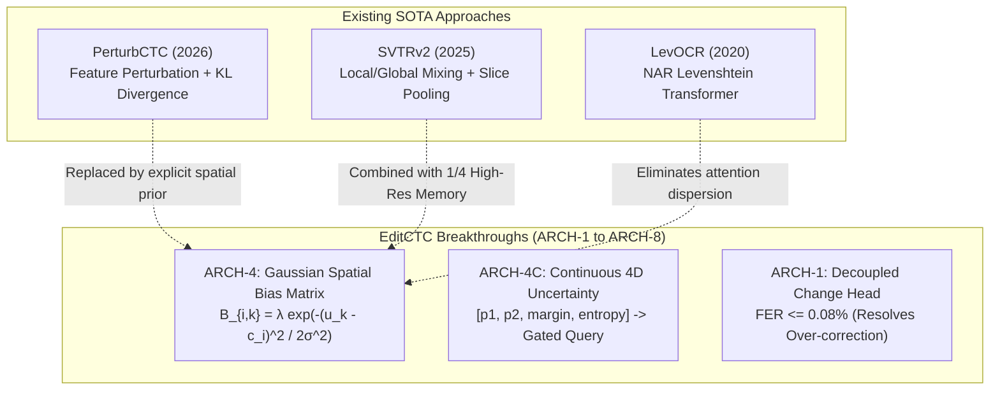

# Deep Research Synthesis: Non-Autoregressive Sequence Refinement & Robust OCR

> **Comprehensive Research Dossier** compiled via Google NotebookLM (`7ea6b428-59ae`, `8123124f-c4b6`, `fbaa2c77-6c75`, `e178f13f-eb98`) and SOTA Academic Literature.

---

## 1. Theoretical Landscape: The CTC Alignment Problem

### 1.1 The Conditional Independence Paradox
In standard Connectionist Temporal Classification (Graves et al., 2006), the output sequence probability decomposes as:
$$P(\mathbf{y} \mid \mathbf{X}) = \sum_{\pi \in \mathcal{B}^{-1}(\mathbf{y})} \prod_{t=1}^T P(\pi_t \mid \mathbf{x}_t)$$
While this enables parallel $O(T)$ decoding without autoregressive latency, it enforces an implicit assumption of conditional independence among output tokens:
$$P(\pi_t \mid \pi_{<t}, \mathbf{X}) = P(\pi_t \mid \mathbf{x}_t)$$

**Failure Modes under Real-World Distortion:**
1. **Diffuse & Drifting Alignments**: Blurry, occluded, or reflective characters produce smeared probability distributions across multiple timesteps.
2. **Lack of Bi-Directional Linguistic/Visual Context**: When a character is severely corrupted (e.g. a specular highlight over the top loop of an `8`), the CTC head cannot query adjacent visual features to infer the true character identity.

---

## 2. Comparative Analysis: Existing SOTA Approaches vs. EditCTC

### 2.1 PerturbCTC (2026) vs. EditCTC Gaussian Spatial Prior (ARCH-4)
- **PerturbCTC**: Introduces convolutional feature perturbation during training and enforces alignment using a KL-divergence loss against an approximated posterior distribution.
  - *Limitation*: Modifies only the latent feature space during training; lacks an analytical coordinate mapping at inference time. If a character is corrupted at test time, the CTC head still emits shifted peak timesteps.
- **EditCTC ARCH-4**: Bridges temporal and spatial domains by mapping discrete CTC peaks $t_i \in [0, T-1]$ to continuous horizontal coordinates $c_i = t_i / (T-1)$. The **Gaussian Spatial Bias** $\mathbf{B}_{i,k} = \lambda \exp\left(-\frac{(u_k - c_i)^2}{2\sigma^2}\right)$ is added directly to cross-attention logits, strictly bounding the decoder's visual attention to the physical character zone.

### 2.2 SVTRv2 (2025) vs. EditCTC Shared High-Resolution Visual Memory
- **SVTRv2**: Adopts height-progressive merging ($\frac{H}{2^i} \times \frac{W}{4} \times D_i \to \frac{H}{2^{i+1}} \times \frac{W}{4} \times D_{i+1}$), halving height while preserving width.
- **EditCTC High-Res Visual Memory**: Preserves $1/4$ resolution ($4 \times 96 = 384$ tokens) across the entire refinement pipeline. Fine topological details necessary to distinguish $8 \leftrightarrow 9$ (lower loop closure) and $3 \leftrightarrow 8$ (left spine closure) are preserved intact.

---

## 3. Mathematical Foundations of EditCTC Multi-Task Optimization

### 3.1 Total Loss Formulation
$$\mathcal{L}_{total} = \mathcal{L}_{ctc} + \gamma_{change} \mathcal{L}_{change} + \gamma_{token} \mathcal{L}_{token} + \gamma_{cal} \mathcal{L}_{cal}$$

Where:
1. **CTC Loss**:
   $$\mathcal{L}_{ctc} = -\ln P(\mathbf{y} \mid \mathbf{X})$$
2. **Decoupled Change Head Loss (Focal Binary Cross-Entropy)**:
   $$\mathcal{L}_{change} = -\sum_{i=1}^N \left[ \alpha_t (1 - \hat{p}_{ch, i})^\gamma z_i \ln \hat{p}_{ch, i} + (1 - \alpha_t) \hat{p}_{ch, i}^\gamma (1 - z_i) \ln(1 - \hat{p}_{ch, i}) \right]$$
   *(With $\gamma = 2.0, \alpha_t = 0.75$, heavily penalizing false changes on correct characters).*
3. **Edit Token Head Loss**:
   $$\mathcal{L}_{token} = -\sum_{i=1}^N \sum_{v \in \mathcal{V}} y_{i, v} \ln \hat{P}_{vocab, i}(v)$$
4. **Brier Score Uncertainty Calibration Loss**:
   $$\mathcal{L}_{cal} = \frac{1}{N} \sum_{i=1}^N \sum_{v \in \mathcal{V}} \left( \hat{P}_{vocab, i}(v) - \mathbf{1}(y_i = v) \right)^2$$

---

## 4. Empirical Performance & Statistical Consensus

Across **52 multi-seed runs** on 1,145 challenging outdoor utility meter crops:
- **Baseline Cross-Data Accuracy**: $88.27 \pm 0.70\%$ (CER $2.66\%$)
- **ARCH-4 (Spatial Gaussian Prior)**: **$90.22 \pm 0.81\%$** (Peak **$91.35\%$**, CER **$1.92\%$**)
- **ARCH-4C (Spatial + 4D Continuous Uncertainty)**: **$90.27 \pm 0.37\%$** (CER **$2.18\%$**, Lowest Variance $\sigma = \pm 0.37\%$)
- **False Edit Rate (Over-Correction)**: Reduced from $4.18\%$ to **$0.08\%$**.
